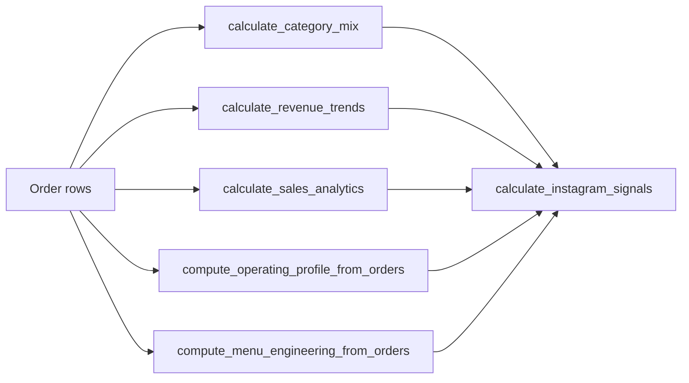

# Menuyukti analytics (`packages/menuyukti`)

This skill is for **Cursor/agents** working on the **shared Python package** [`packages/menuyukti`](../../../packages/menuyukti). **Agents** consume analytics as **GraphQL JSON** after `apps/graphql` runs these pipelines — they do not import this package directly.

## Companion skills

When implementing in **`packages/menuyukti` analytics**, follow these skills in addition to this doc.

- [`pandas-pro`](../pandas-pro/SKILL.md) — DataFrame manipulation, cleaning, aggregation, merges, and performance (vectorized patterns align with conventions here).
- [`python-design-patterns`](../python-design-patterns/SKILL.md) — Layering, single responsibility, composition over inheritance, and keeping calculate/compute boundaries clear.

## Where the code lives

| Area                    | Path                                                                                                                                                                   | Role                                                                                       |
| ----------------------- | ---------------------------------------------------------------------------------------------------------------------------------------------------------------------- | ------------------------------------------------------------------------------------------ |
| **Analytics modules**   | [`packages/menuyukti/src/menuyukti/core/analytics/`](../../../packages/menuyukti/src/menuyukti/core/analytics/)                                                        | Pandas pipelines + pure composition                                                        |
| **Registry / helpers**  | [`registry.py`](../../../packages/menuyukti/src/menuyukti/core/analytics/registry.py), [`utils.py`](../../../packages/menuyukti/src/menuyukti/core/analytics/utils.py) | POS normalizer registry (`NORMALIZERS`, `get_normalizer`)                                  |
| **Ingest normalizers**  | [`esb/`](../../../packages/menuyukti/src/menuyukti/core/analytics/esb/), [`quino/`](../../../packages/menuyukti/src/menuyukti/core/analytics/quino/)                   | Format-specific row normalization for supported POS exports                                |
| **Line-item model**     | [`packages/menuyukti/src/menuyukti/core/models/pos_transaction.py`](../../../packages/menuyukti/src/menuyukti/core/models/pos_transaction.py)                          | `POSTransactionLineItem` column names                                                      |
| **Unit tests**          | [`packages/menuyukti/tests/unit/core/analytics/`](../../../packages/menuyukti/tests/unit/core/analytics/)                                                              | Pytest for `calculate_*` / `compute_*`                                                     |
| **GraphQL integration** | [`apps/graphql/reports/transform.py`](../../../apps/graphql/reports/transform.py), [`apps/graphql/services/`](../../../apps/graphql/services/)                         | Maps ingest rows → DataFrame → `calculate_*` (do **not** build ad hoc frames in resolvers) |

**Agents** (`apps/agents`) call **GraphQL over HTTP**; they do **not** import this package directly. New **HTTP-facing** shapes belong in GraphQL after the package API is stable — see [`menuyukti-graphql`](../menuyukti-graphql/SKILL.md).

## Public pipelines (summary)

| Function / entrypoint                        | Input                                           | Output idea                                          |
| -------------------------------------------- | ----------------------------------------------- | ---------------------------------------------------- |
| `calculate_sales_analytics`                  | Full line-item frame                            | Totals, popularity, heatmaps, period, tiered signals |
| `compute_sales_analytics_from_orders`        | Typed order rows                                | Delegates to `calculate_sales_analytics`             |
| `calculate_menu_heatmaps`                    | `menu`, `qty`, `order_time`, …                  | Per-menu hourly/weekly grids                         |
| `compute_menu_heatmaps_from_orders`          | Typed order rows                                | Delegates to `calculate_menu_heatmaps`               |
| `compute_operating_profile_from_orders`      | Bill-level rows + optional holidays             | Meal periods, DOW, labels                            |
| `calculate_menu_engineering_matrix`          | Menu-level revenue + COGS                       | Star / plow_horse / puzzle / low_end                 |
| `compute_menu_engineering_from_orders`       | Typed order rows                                | Delegates to `calculate_menu_engineering_matrix`     |
| `calculate_category_mix`                     | Line items with optional categories             | Revenue/qty share per category                       |
| `calculate_revenue_trends`                   | Current vs previous period frames               | Deltas, ranks, trend labels                          |
| `calculate_popularity_index`                 | Frame per `popularity_index_columns`            | Popularity scoring where used                        |
| `calculate_menu_basket_affinities`           | Line-item frame                                 | Co-purchase pair affinities                          |
| `compute_menu_basket_affinities_from_orders` | Typed order rows                                | Delegates to basket affinities                       |
| `compute_combo_pair_timing_from_orders`      | Combo timing rows                               | Recommended windows per pair                         |
| `calculate_slot_demand_profile`              | Slot-level demand rows                          | Slot demand cells for scheduling/combos              |
| `compute_slot_demand_profile_from_orders`    | Typed order rows                                | Delegates to slot demand profile                     |
| `derive_combo_promo_posture`                 | Combo timing + slot profile                     | Promo posture per pair                               |
| `calculate_instagram_signals`                | **Precomputed** dicts/results only              | Heroes, trending, avoid, posting window, headline    |
| `extract_menu_items`                         | Line-item DataFrame (`menu`, `qty`, `price`, …) | Aggregated per-menu facts for analytics              |
| `detect_pos_from_excel_bytes`                | Raw bytes                                       | POS flavor hint for ingest                           |

Authoritative exports: [`analytics/__init__.py`](../../../packages/menuyukti/src/menuyukti/core/analytics/__init__.py) (`__all__`).

## Conventions (must follow)

1. **`TypedDict`** for line-level inputs lives **next to** the module that consumes it (`OrderRowForHeatmap`, `OrderRowForCategoryMix`, …).
2. **`calculate_<name>(df)`** starts with **`require_columns(df, <name>_columns(), context="calculate_<name>")`** (or `line_item_columns_full()` / `ensure_optional_category_columns` where categories are optional).
3. **`compute_<name>_from_orders(rows)`** builds `pd.DataFrame(rows)` and calls `calculate_<name>`; empty inputs: raise `ValueError` or return an empty structured result **consistently** with sibling modules.
4. **Vectorized pandas** — groupby/merge/resample; avoid `iterrows` for aggregations (see Companion skills — [pandas-pro](../pandas-pro/SKILL.md)).
5. **Composition-only** modules (e.g. `calculate_instagram_signals`) take **structured results**, not raw `DataFrame`s — no pandas inside those files.

Details: [`analytics/__init__.py`](../../../packages/menuyukti/src/menuyukti/core/analytics/__init__.py) module docstring and [`frame_contracts.py`](../../../packages/menuyukti/src/menuyukti/core/analytics/frame_contracts.py).

## Instagram agent flow

`calculate_instagram_signals` expects **already computed** `CategoryMixResult`, `RevenueTrendsResult`, the **dict** from `calculate_sales_analytics`, optional `OperatingProfileResult`, and optional `MenuEngineeringMatrixResult` (omit when COGS is unavailable).

Returned lists (`content_heroes`, `avoid_items`, `trending_items`) are **top-N capped** for API/LLM size; full matrix input is unchanged.

## Progressive disclosure

If this file grows, split long API tables into `reference.md` in this folder.

## Related

- [`menuyukti-repo-orientation`](../menuyukti-repo-orientation/SKILL.md) — monorepo boundaries, pnpm vs uv.
- [`menuyukti-graphql`](../menuyukti-graphql/SKILL.md) — Strawberry layer and `reports/transform` integration.
- [`menuyukti-agents`](../menuyukti-agents/SKILL.md) — chat tools consume GraphQL payloads derived from this package.
