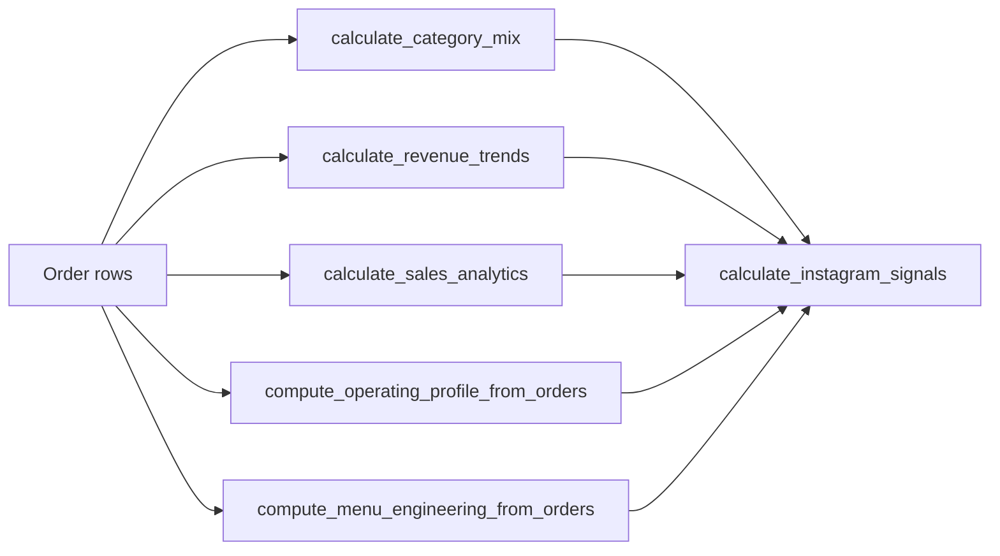

# Menuyukti analytics (`packages/menuyukti`)

This skill is for **Cursor/agents** working on the **shared Python package** [`packages/menuyukti`](../../../packages/menuyukti). It is **not** a runtime milestone skill under `packages/agent-skills/` (those feed `skill_runner`).

## Where the code lives

| Area                    | Path                                                                                                                                          | Role                                                                                       |
| ----------------------- | --------------------------------------------------------------------------------------------------------------------------------------------- | ------------------------------------------------------------------------------------------ |
| **Analytics modules**   | [`packages/menuyukti/src/menuyukti/core/analytics/`](../../../packages/menuyukti/src/menuyukti/core/analytics/)                               | Pandas pipelines + pure composition                                                        |
| **Line-item model**     | [`packages/menuyukti/src/menuyukti/core/models/pos_transaction.py`](../../../packages/menuyukti/src/menuyukti/core/models/pos_transaction.py) | `POSTransactionLineItem` column names                                                      |
| **Unit tests**          | [`packages/menuyukti/tests/unit/core/analytics/`](../../../packages/menuyukti/tests/unit/core/analytics/)                                     | Pytest for each `calculate_*`                                                              |
| **GraphQL integration** | [`apps/graphql/reports/transform.py`](../../../apps/graphql/reports/transform.py)                                                             | Maps ingest rows → DataFrame → `calculate_*` (do **not** build ad hoc frames in resolvers) |

**Agents app** (`apps/agents`) calls **GraphQL over HTTP** for data; it does **not** import SQLAlchemy or open DB connections. New **HTTP-facing** shapes belong in GraphQL schema/resolvers after the package API is stable.

## Public pipelines (summary)

| Function                                | Input                               | Output idea                                       |
| --------------------------------------- | ----------------------------------- | ------------------------------------------------- |
| `calculate_sales_analytics`             | Full line-item frame                | Totals, popularity, heatmaps, period              |
| `calculate_menu_heatmaps`               | `menu`, `qty`, `order_time`, …      | Per-menu hourly/weekly grids                      |
| `compute_operating_profile_from_orders` | Bill-level rows + optional holidays | Meal periods, DOW, labels                         |
| `calculate_menu_engineering_matrix`     | Menu-level revenue + COGS           | Star / plow_horse / puzzle / low_end              |
| `calculate_category_mix`                | Line items with optional categories | Revenue/qty share per category                    |
| `calculate_revenue_trends`              | Current vs previous period frames   | Deltas, ranks, trend labels                       |
| `calculate_instagram_signals`           | **Precomputed** dicts only          | Heroes, trending, avoid, posting window, headline |

## Conventions (must follow)

1. **`TypedDict`** for line-level inputs lives **next to** the module that consumes it (`OrderRowForHeatmap`, `OrderRowForCategoryMix`, …).
2. **`calculate_<name>(df)`** starts with **`require_columns(df, <name>_columns(), context="calculate_<name>")`** (or `line_item_columns_full()` / `ensure_optional_category_columns` where categories are optional).
3. **`compute_<name>_from_orders(rows)`** builds `pd.DataFrame(rows)` and calls `calculate_<name>`; empty inputs: raise `ValueError` or return an empty structured result **consistently** with sibling modules.
4. **Vectorized pandas** — groupby/merge/resample; avoid `iterrows` for aggregations (see pandas-pro skill patterns).
5. **Composition-only** modules (e.g. `calculate_instagram_signals`) take **structured results**, not raw `DataFrame`s — no pandas inside those files.

Details are spelled out in the package docstring: [`analytics/__init__.py`](../../../packages/menuyukti/src/menuyukti/core/analytics/__init__.py) and [`frame_contracts.py`](../../../packages/menuyukti/src/menuyukti/core/analytics/frame_contracts.py).

## Instagram agent flow

`calculate_instagram_signals` expects **already computed** `CategoryMixResult`, `RevenueTrendsResult`, the **dict** from `calculate_sales_analytics`, optional `OperatingProfileResult`, and optional `MenuEngineeringMatrixResult` (omit when COGS is unavailable).

## Progressive disclosure

If this file grows, split long API tables into `reference.md` in this folder.

## Related

- [`menuyukti-repo-orientation`](../menuyukti-repo-orientation/SKILL.md) — monorepo boundaries, pnpm vs uv.
- [`menuyukti-data-provider`](../menuyukti-data-provider/SKILL.md) — milestone prefetch and skill_runner (separate from package analytics).
- [`.agents/skills/pandas-pro/SKILL.md`](../pandas-pro/SKILL.md) — DataFrame performance and validation patterns.
