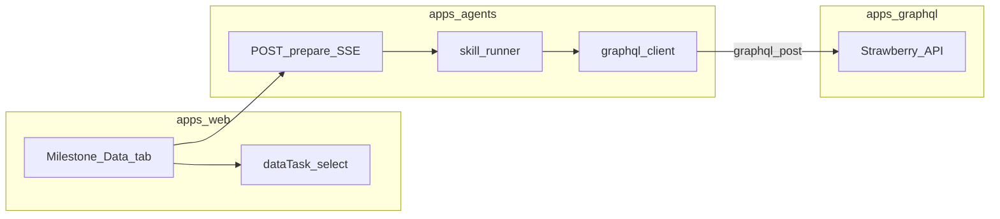

# Menuyukti: milestone data provider (skill_runner)

Milestone **Data** tasks that use **Prepare** (instead of manual textarea) load a **runtime** `SKILL.md` from **`packages/agent-skills/src/agent_skills/skills/<skill_id>/`** (resolved at runtime via `agent_skills.get_skill_path`). The canonical example is [`location_profile/SKILL.md`](../../../packages/agent-skills/src/agent_skills/skills/location_profile/SKILL.md).

This guide is for **implementing** a new provider: GraphQL (and optional `packages/menuyukti`) → agents prefetch → `SKILL.md` contract → milestone UI / prepare route.

## Runtime SKILL.md shape (required)

The agents loader [`load_skill`](../../../apps/agents/agents/domain/skill_runner/loader.py) expects:

1. YAML **frontmatter** with `name`, `description`, and a **`menuyukti:`** mapping (not optional).
2. **Markdown body** after `---` — used as the **system** message to the LLM (instructions, tone, rules).

Minimal template (replace placeholders; align `use` with real handlers—see below):

```yaml
---
name: your-skill-id
description: >-
  One line: what the prepare step produces and when the milestone data task should use it.

menuyukti:
  version: 1

  human_message_template: |
    {# Jinja2: context.<id> matches each data_requirements[].id #}
    Your structured inputs (JSON):
    {{ context.my_data | tojson(indent=2) }}

    Produce the requested output in Markdown.

  data_requirements:
    - id: my_data
      use: your.namespace.handler_key
      inputs:
        location_id: '{{ env.location_id }}'
      required: true
---
You are a helpful assistant. Follow the product rules below.
(Your system prompt body goes here—same role as location_profile body.)
```

### `menuyukti` fields

| Field                    | Purpose                                                                                    |
| ------------------------ | ------------------------------------------------------------------------------------------ |
| `version`                | Must be `1` for current loader.                                                            |
| `human_message_template` | Jinja2 template; use `context.<id>` for each prefetch result, `tojson` filter for objects. |
| `data_requirements`      | Ordered steps; each yields `context[id]`.                                                  |

### Each `data_requirements` entry

| Key        | Purpose                                                                                                                                                           |
| ---------- | ----------------------------------------------------------------------------------------------------------------------------------------------------------------- |
| `id`       | Key into `context` for templates and prefetch SSE steps (`fetch_<id>`).                                                                                           |
| `use`      | Registry key in [`PREFETCH_HANDLERS`](../../../apps/agents/agents/domain/skill_runner/handlers.py). **Must match** an existing or newly added handler.            |
| `inputs`   | Strings; may use `{{ env.milestone_id }}`, `{{ env.location_id }}`, `{{ env.user_id }}` — see [`RunEnv`](../../../apps/agents/agents/domain/skill_runner/env.py). |
| `required` | If `true`, empty/falsy result raises before the LLM runs.                                                                                                         |

### Registered prefetch handlers (today)

Implementations live in [`handlers.py`](../../../apps/agents/agents/domain/skill_runner/handlers.py); GraphQL calls live in [`skill_runner/graphql_client.py`](../../../apps/agents/agents/domain/skill_runner/graphql_client.py).

| `use`                                | Role                                                                |
| ------------------------------------ | ------------------------------------------------------------------- |
| `platform.location`                  | Location record for `location_id`.                                  |
| `platform.public_holidays`           | Holidays for country + date range.                                  |
| `analytics.latest_operating_profile` | Latest analytics run + operating profile for `location_id`.         |
| `analytics.instagram_signals`        | Latest run: composite Instagram signals (heroes, window, headline). |
| `analytics.promotion_menu_items`     | Latest run: per-menu promotion rows (engineering + peaks).          |
| `analytics.category_mix`             | Latest run: category revenue/qty mix.                               |
| `analytics.revenue_trends`           | Latest run: per-menu revenue vs prior period.                       |

**New data:** add async handler → register in `PREFETCH_HANDLERS` → add `fetch_*` helpers that call `graphql_post` (same pattern as existing fetches). Heavy analytics belong in **`packages/menuyukti`**; GraphQL stays thin — see [GraphQL README](../../../apps/graphql/README.md) and [menuyukti README](../../../packages/menuyukti/README.md).

## End-to-end flow



[`run_skill_events`](../../../apps/agents/agents/domain/skill_runner/runner.py): prefetch → render `human_message_template` → LLM stream → [`persist_milestonedata_markdown`](../../../apps/agents/agents/core/milestone_data/). The model does **not** call a save tool; persistence is after generation (same as location_profile **Persistence** section).

## GraphQL and `menuyukti` checklist

1. **Schema** — types and query mixin under [`apps/graphql/schema/queries/`](../../../apps/graphql/schema/queries/); compose into [`query.py`](../../../apps/graphql/schema/query.py); auth/session per [python-graphql-conventions](../../../.cursor/rules/python-graphql-conventions.mdc).
2. **Logic** — non-trivial math in [`packages/menuyukti`](../../../packages/menuyukti); resolvers map ORM/rows to types.
3. **Persistence** — new tables/columns only in **`apps/graphql`**.
4. **Tests** — [`apps/graphql/tests/`](../../../apps/graphql/tests/).
5. **Workflow roots** — The location-scoped workflow container is a GraphQL `Node` with **`nodeType` `workflow`** (milestones hang under it).

## Agents checklist

1. **`graphql_post`** — [`graphql_base.py`](../../../apps/agents/agents/graphql_base.py); env `GRAPHQL_ENDPOINT`, optional `GRAPHQL_INTERNAL_API_KEY`, `X-User-Id`.
2. **Prefetch** — add `fetch_*` in `skill_runner/graphql_client.py`, wire in `handlers.py` under a new `use` string (dot-separated namespace recommended).
3. **SKILL file** — add `packages/agent-skills/src/agent_skills/skills/<skill_id>/SKILL.md` with valid `menuyukti` YAML and body (folder name must match `data_task` / milestone `dataTask`).

## Milestone card and Prepare API

[`milestone_prepare.py`](../../../apps/agents/routers/milestone_prepare.py) resolves the skill with **`get_skill_path(body.data_task)`** (default `location_profile`). The Next.js BFF forwards `data_task` from the milestone Data source.

To expose a **new** task from the milestone **Data** dropdown:

- Add the skill folder + `SKILL.md` under `packages/agent-skills/…/skills/<skill_id>/`.
- Extend **`dataTask`** enums and Zod schemas (e.g. [`timeline/types.ts`](<../../../apps/web/app/(protected)/workflows/_components/timeline/types.ts>), [`node-schemas.ts`](../../../apps/web/lib/graphql/node-schemas.ts), [`schema.ts`](../../../apps/web/app/api/workflows/[id]/milestones/schema.ts)) and the Select in [`milestone-item-tabs.tsx`](<../../../apps/web/app/(protected)/workflows/_components/timeline/milestone-item-tabs.tsx>).
- Add **next-intl** strings for the new option (no hardcoded UI copy).
- Ensure GraphQL export/import preserves the new `dataTask` value if workflows are exported (see `export_workflow.py` / `import_workflow.py`).

New skills can be tested by calling `run_skill_events(get_skill_path("your_skill_id"), ...)` in tests.

## Reference chain

| Layer                     | Example                                                                                                                                                           |
| ------------------------- | ----------------------------------------------------------------------------------------------------------------------------------------------------------------- |
| Milestone skill (runtime) | [`packages/agent-skills/.../location_profile/SKILL.md`](../../../packages/agent-skills/src/agent_skills/skills/location_profile/SKILL.md)                         |
| Prefetch + handlers       | [`prefetch.py`](../../../apps/agents/agents/domain/skill_runner/prefetch.py), [`handlers.py`](../../../apps/agents/agents/domain/skill_runner/handlers.py)        |
| GraphQL + `menuyukti`     | [`menu_heatmaps.py`](../../../apps/graphql/schema/queries/menu_heatmaps.py), [`services/menu_engineering.py`](../../../apps/graphql/services/menu_engineering.py) |

## Canonical docs

- [`AGENTS.md`](../../../AGENTS.md) — commands and monorepo layout.
- [`apps/graphql/README.md`](../../../apps/graphql/README.md), [`packages/menuyukti/README.md`](../../../packages/menuyukti/README.md).

## Progressive disclosure

Split long API notes into `reference.md` in this folder if this file grows.

## Non-goals

- Duplicating full monorepo command lists — link **AGENTS.md** instead.
- Full Next.js data-fetching tutorial — see web conventions / GraphQL client in the web app when the UI must consume the same fields.

## Roadmap (future Cursor skills)

| Skill                                                                  | Purpose                                  |
| ---------------------------------------------------------------------- | ---------------------------------------- |
| [`menuyukti-repo-orientation`](../menuyukti-repo-orientation/SKILL.md) | App boundaries, DB ownership, pnpm vs uv |
| `menuyukti-web-graphql-consumer`                                       | Web GraphQL + Clerk + next-intl          |
| `menuyukti-pr-checklist`                                               | Pre-PR commands aligned with CI          |
