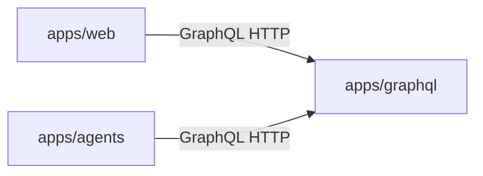

# Menuyukti: repository orientation

This skill is for **Cursor/agents** navigating the repo. It is **not** a runtime milestone skill under `apps/agents/skills/` (those feed `skill_runner`).

## Service map

| Area                 | Path           | Role                                                                                                                                                                 |
| -------------------- | -------------- | -------------------------------------------------------------------------------------------------------------------------------------------------------------------- |
| **Web**              | `apps/web`     | Next.js UI: chat, campaigns, CRUD. **Reads/writes go through GraphQL** (not direct DB).                                                                              |
| **GraphQL API**      | `apps/graphql` | Strawberry schema, **SQLAlchemy persistence**, analytics. **Single HTTP API** for structured data used by web and agents.                                            |
| **LangGraph agents** | `apps/agents`  | FastAPI, LangChain / LangGraph. **Calls GraphQL over HTTP** (e.g. `httpx`); **does not** open database connections.                                                  |
| **Shared packages**  | `packages/*`   | Shared TypeScript libraries; Python shared code may live under [`packages/menuyukti`](../../../packages/menuyukti) and app-local packages per root workspace config. |

## Database ownership

- **Schema, migrations, and SQLAlchemy** live **only** in **`apps/graphql`**.
- **`apps/web`** and **`apps/agents`** must **not** add DB drivers, connection strings for app data, or migration scripts for product data.
- Turbo may expose `db:*` scripts when the GraphQL package defines them; **ownership** stays in GraphQL — see [AGENTS.md](../../../AGENTS.md) and `apps/graphql` README / Makefile.

## pnpm versus uv

| Use                   | Tool     | Scope                                                                                          |
| --------------------- | -------- | ---------------------------------------------------------------------------------------------- |
| **Node / TypeScript** | **pnpm** | Workspaces `apps/*`, `packages/*`; root scripts (`pnpm build`, `pnpm lint`, …). Node **>=20**. |
| **Python**            | **uv**   | Root `pyproject.toml` workspace; `uv sync`, `uv run`, `uv add` from repo root or app dirs.     |

**Do not** suggest `npm` or `yarn` for installs, or ad-hoc `pip install` as the default workflow.

## Canonical references

- [AGENTS.md](../../../AGENTS.md) — commands, ports, layout table.
- [`.cursor/rules/project-overview.mdc`](../../../.cursor/rules/project-overview.mdc) — product context and layering.
- [`.cursor/rules/monorepo-conventions.mdc`](../../../.cursor/rules/monorepo-conventions.mdc) — pnpm, Turbo, uv, formatting.
- [`.agents/skills/turborepo/SKILL.md`](../turborepo/SKILL.md) — Turbo pipelines, caching, `--filter`.

## Non-goals

- **Duplicating** full command matrices — link **AGENTS.md** instead.
- **Runtime milestone SKILL.md** authoring — see [`menuyukti-data-provider`](../menuyukti-data-provider/SKILL.md).

## Progressive disclosure

If this file grows, split long reference material into `reference.md` in this folder.
