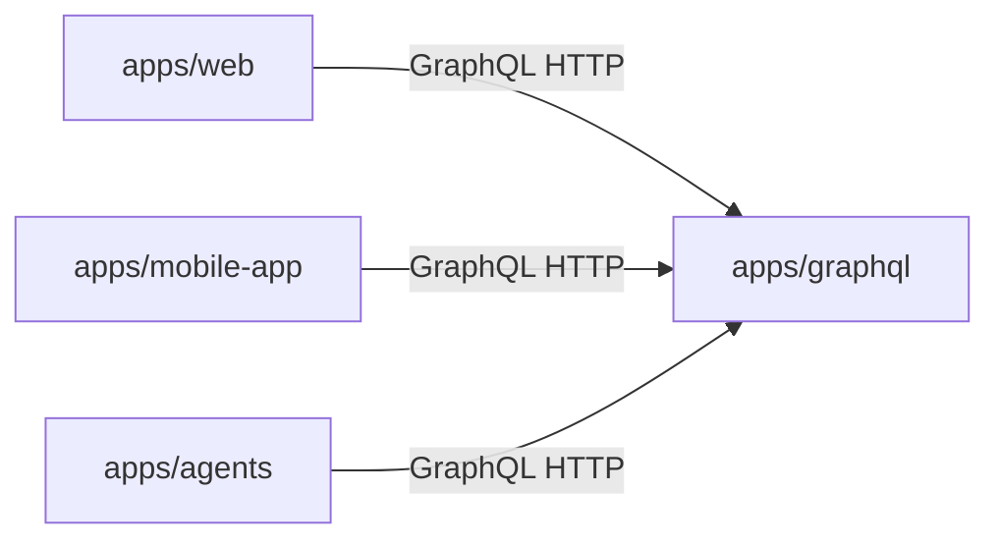

# Menuyukti: repository orientation

This skill is for **Cursor/agents** navigating the repo. **Runtime milestone execution** uses dedicated **preset subgraphs** in `apps/agents/agents/core/milestone_run/<preset_id>/` (see [`menuyukti-agents`](../menuyukti-agents/SKILL.md)).

## Service map

| Area                 | Path              | Role                                                                                                                                                      |
| -------------------- | ----------------- | --------------------------------------------------------------------------------------------------------------------------------------------------------- |
| **Web**              | `apps/web`        | Next.js UI: chat, campaigns, CRUD. **Reads/writes go through GraphQL** (not direct DB). Workflow roots use GraphQL **`nodeType` `workflow`**.             |
| **Mobile**           | `apps/mobile-app` | Expo (React Native) client. **Reads/writes go through GraphQL** (not direct DB).                                                                          |
| **GraphQL API**      | `apps/graphql`    | Strawberry schema, **SQLAlchemy persistence**, analytics. **Single HTTP API** for structured data used by web and agents.                                 |
| **LangGraph agents** | `apps/agents`     | FastAPI, LangChain / LangGraph. **Calls GraphQL over HTTP** (e.g. `httpx`); **does not** open database connections.                                       |
| **Shared packages**  | `packages/*`      | Shared TypeScript libraries; Python: [`packages/menuyukti`](../../../packages/menuyukti) (analytics), optional legacy workspace packages per root config. |

## Domain skills (go deeper)

| Skill                                                    | When to open it                                                                             |
| -------------------------------------------------------- | ------------------------------------------------------------------------------------------- |
| [`menuyukti-agents`](../menuyukti-agents/SKILL.md)       | `apps/agents`: FastAPI, LangGraph milestone run (preset subgraphs + eval), streaming chat.  |
| [`menuyukti-graphql`](../menuyukti-graphql/SKILL.md)     | `apps/graphql`: Strawberry, Alembic, resolvers, queries for web/agents.                     |
| [`menuyukti-web`](../menuyukti-web/SKILL.md)             | `apps/web`: Next.js, Clerk, next-intl, GraphQL from the browser/BFF, milestone UI.          |
| [`menuyukti-mobile`](../menuyukti-mobile/SKILL.md)       | `apps/mobile-app`: Expo, CRM enroll, React Navigation, brand/session, mobile HTTP clients.  |
| [`menuyukti-analytics`](../menuyukti-analytics/SKILL.md) | `packages/menuyukti`: pandas pipelines, Instagram signals, GraphQL `transform` integration. |

## Cross-app flow: milestone run

The web BFF streams **`POST .../milestones/{id}/run`** to agents; the LangGraph run resolves **`presetId`**, executes the matching preset subgraph, then runs shared eval. See [`menuyukti-agents`](../menuyukti-agents/SKILL.md), [`menuyukti-web`](../menuyukti-web/SKILL.md), and [`menuyukti-graphql`](../menuyukti-graphql/SKILL.md).

## Database ownership

- **Schema, migrations, and SQLAlchemy** live **only** in **`apps/graphql`**.
- **`apps/web`**, **`apps/mobile-app`**, and **`apps/agents`** must **not** add DB drivers, connection strings for app data, or migration scripts for product data.
- Turbo may expose `db:*` scripts when the GraphQL package defines them; **ownership** stays in GraphQL — see [AGENTS.md](../../../AGENTS.md) and `apps/graphql` README / Makefile.

## pnpm versus uv

| Use                   | Tool     | Scope                                                                                          |
| --------------------- | -------- | ---------------------------------------------------------------------------------------------- |
| **Node / TypeScript** | **pnpm** | Workspaces `apps/*`, `packages/*`; root scripts (`pnpm build`, `pnpm lint`, …). Node **>=20**. |
| **Python**            | **uv**   | Root `pyproject.toml` workspace; `uv sync`, `uv run`, `uv add` from repo root or app dirs.     |

**Do not** suggest `npm` or `yarn` for installs, or ad-hoc `pip install` as the default workflow.

## Canonical references

- [AGENTS.md](../../../AGENTS.md) — commands, ports, layout table.
- [`.cursor/rules/project-overview.mdc`](../../../.cursor/rules/project-overview.mdc) — product context and layering.
- [`.cursor/rules/monorepo-conventions.mdc`](../../../.cursor/rules/monorepo-conventions.mdc) — pnpm, Turbo, uv, formatting.
- [`.agents/skills/turborepo/SKILL.md`](../turborepo/SKILL.md) — Turbo pipelines, caching, `--filter`.

## Non-goals

- **Duplicating** full command matrices — link **AGENTS.md** instead.
- **Per-app implementation detail** — use the domain skills above.

## Progressive disclosure

If this file grows, split long reference material into `reference.md` in this folder.
