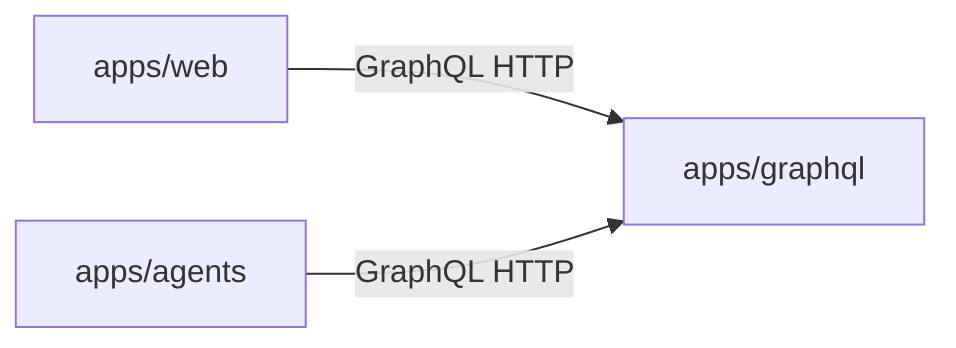
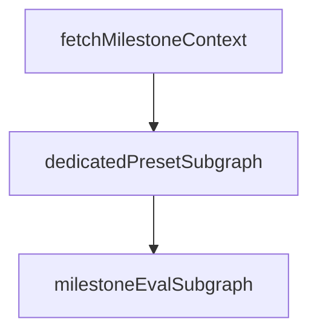

# Menuyukti platform architecture

This document describes how the Menuyukti services and packages fit together, with emphasis on the **agentic AI** path (milestone runs, presets, and chat tools). For local commands, ports, and CI, see [AGENTS.md](AGENTS.md). For a **user-facing overview and marketer positioning**, see [README.md](README.md).

## Platform model

Menuyukti models work as **workflow-oriented campaigns**. In GraphQL, the campaign container is a `node` with **`nodeType` `workflow`**. Under it, **milestones** run in order. Each milestone can **fetch** inputs, **invoke an LLM** (and supporting logic), and **persist output** as **milestone data** for the next step, for evaluation, or for export. The platform is optimized for **structured, reusable artifacts** (profiles, briefs, captions, scored evaluations), not chat alone.

## Three-service system

| Service         | Path           | Role                                                                                                                                                                     |
| --------------- | -------------- | ------------------------------------------------------------------------------------------------------------------------------------------------------------------------ |
| **Web**         | `apps/web`     | Next.js UI: workflows, chat, artifacts, CRUD. **Reads and writes product data only through GraphQL** (no application database).                                          |
| **GraphQL API** | `apps/graphql` | Strawberry schema, **SQLAlchemy** persistence, **PostgreSQL**, **Alembic** migrations. **Single HTTP API** for structured data and analytics consumed by web and agents. |
| **Agents**      | `apps/agents`  | FastAPI, **LangChain / LangGraph**. Streaming chat and milestone runs. Calls GraphQL over **HTTP** (`httpx`); **does not** open database connections to product data.    |

Typical local ports: GraphQL **8000**, web **3000**, agents **8001** (see [AGENTS.md](AGENTS.md) for exact dev commands).

## GraphQL service (`apps/graphql`)

- **Schema** is composed from modules under `apps/graphql/schema/` (queries, mutations, types). Entry composition lives in `apps/graphql/schema/query.py`.
- **Domain logic** that belongs in services sits under `apps/graphql/services/`.
- **Analytics and ingest** bridge through `apps/graphql/reports/transform.py`: rows are turned into DataFrames and delegated to **`packages/menuyukti`** (`calculate_*` / `compute_*` pipelines). Heavy pandas work stays out of thin resolvers; see [.agents/skills/menuyukti-graphql/SKILL.md](.agents/skills/menuyukti-graphql/SKILL.md) and [.agents/skills/menuyukti-analytics/SKILL.md](.agents/skills/menuyukti-analytics/SKILL.md).
- **Schema changes** are **only** in this app via Alembic under `apps/graphql/alembic/`.
- **Agents as clients**: milestone-run code in `apps/agents` expects **stable, JSON-friendly** response shapes from dedicated GraphQL helpers (`apps/agents/agents/core/milestone_run/graphql_client.py` and related modules).

Auth and resolver conventions follow `.cursor/rules/python-graphql-conventions.mdc` (summary: session-aware resolvers, consistent with how the web app calls GraphQL).

## Agents service (`apps/agents`)

### Entry points

| Endpoint                              | Purpose                                                                                                                                                                                      |
| ------------------------------------- | -------------------------------------------------------------------------------------------------------------------------------------------------------------------------------------------- |
| `POST /chat`                          | Streaming **SSE** chat over a LangGraph ReAct graph under `apps/agents/agents/core/chat/`.                                                                                                   |
| `POST /milestones/{milestone_id}/run` | **Milestone run**: fetch context → **dedicated preset subgraph** (by `milestone.data.presetId`) → shared **eval** subgraph. Implemented in `apps/agents/agents/core/milestone_run/graph.py`. |
| `POST /format-markdown`               | Platform helper endpoint for preset-driven Markdown cleanup (free-form notes; implemented in `apps/agents/agents/core/format_markdown/` and `apps/agents/routers/format_markdown.py`).       |

Shared GraphQL access uses `apps/agents/agents/graphql_base.py` (`graphql_post`, `GRAPHQL_ENDPOINT`, optional internal API key header). Routers authenticate callers with headers such as **`X-Menuyukti-User-Id`**; GraphQL calls use the project’s server-to-server header conventions (see `.cursor/rules/agents-conventions.mdc`).

### Milestone-run pipeline (agentic core)

The compiled graph is `build_milestone_run_graph` in `apps/agents/agents/core/milestone_run/graph.py`. At a high level:

1. **Fetch children** — load milestone and workflow context from GraphQL (`fetch_children` node). Reuses `milestone_eval.nodes.fetch_context` for goal, milestonedata JSON, and pass criteria. When scoped to a workflow, **`fetch_prior_milestones_data`** adds earlier milestones’ saved data.
2. **Execute preset** — read **`milestone.data.presetId`** and dispatch to a **registered preset runner** (`register_preset_runner` in `graph.py` / `presets/registry.py`). Each preset is a dedicated **`StateGraph`** under `milestone_run/<preset_id>/` with its own nodes, prompts, and GraphQL prefetch helpers.
3. **Finalize evaluation** — invoke the shared **`milestone_eval`** subgraph for parallel criterion scoring, synthesis, and result persistence.

**Registered preset ids** (must match web `MILESTONE_PRESET_IDS`): `dates`, `restaurant_campaign_brief`, `promotion_candidates`, `menu_tagger`, `menu_clusterer`, `culture_hooks`, `ig_profile`, `ig_plan`, `ig_menu_picker`, `ig_format`, `ig_text`, `scheduler`.

Legacy ReAct milestone-run tools under `milestone_run/tools/` remain for **unit tests only**; production preset graphs call GraphQL directly from nodes and persist via `milestone_data` upsert + `validate_skill_output`.

### Context engineering (milestone run and chat)

Both flows ground the model in **GraphQL-backed product state**, but they package context differently: milestone runs **prefetch into LangGraph state** inside preset nodes; chat keeps the **thread small** and loads milestone fields **on demand via tools**.

#### Milestone run

1. **Eager prefetch (`fetch_children`)** — Before the preset subgraph runs, the outer graph loads canonical milestone context from GraphQL (goal, milestonedata, criteria). With a **`workflow_id`**, prior milestones’ data is included for downstream presets (campaign brief → lineups → scheduler, etc.).

2. **Preset subgraph** — Each preset module owns its topology: GraphQL prefetch nodes, structured LLM calls (`structured_ainvoke_from_run_config`), optional reflect loops, and a **`persist_result`** node that upserts milestonedata through `apps/agents/agents/core/milestone_data/`.

3. **Evaluation subgraph** — `finalize_eval` runs **`milestone_eval`**, whose **`fetch_context`** node reloads goal, milestone data, and criteria from GraphQL before parallel criterion scoring and synthesis.

#### Chat

1. **Short-term memory** — The streaming chat graph is compiled once with a LangGraph **checkpointer** (`compile_chat_graph` in `apps/agents/agents/core/chat/graph.py`). Each HTTP request sends **only the latest user message**; prior turns live in checkpoint state keyed by **`thread_id`**: `{clerk_user_id}:wf:{workflow_id}` for campaign chat, or `{clerk_user_id}:agent:{client_thread_id}` for the standalone `/agent` page. Production uses **`PostgresSaver`** when `LANGGRAPH_CHECKPOINT_DATABASE_URL` is set; otherwise an in-memory saver (dev only).

2. **ReAct + milestone tools** — `create_react_agent` exposes tools from `chat_tools_list()` (`get_milestone_data`, help/input/preset read and patch tools, optional **`search_web`**). Context ids come from per-request **`RunnableConfig["configurable"]`**. The shared **`httpx` client** is bound per request via a **context variable** (`agents/core/chat/http_context.py`) so it is never stored in checkpoints.

### Cross-cutting agentic patterns

- **Milestone pipelines** — work is scoped to a milestone inside a workflow; outputs are stored for downstream milestones or UI.
- **Plan-and-execute** — preset subgraphs use explicit multi-step plans (data → slots → schedule → formats → brief style stages).
- **Reflect** — drafts can pass through **generate → critique → revise** with iteration bounds (e.g. campaign brief).
- **LLMs** — configured via Vercel AI Gateway–compatible settings (`AI_GATEWAY_API_KEY`, `VERCEL_OIDC_TOKEN`, optional `OPENAI_MODEL`); details in [AGENTS.md](AGENTS.md) and `apps/agents/.env.example`.
- **Tracing** — LangSmith metadata on runs; product DB rows via `startMilestoneAgentRun` / `completeMilestoneAgentRun` (see `apps/agents/README.md`).

## Skill files (two meanings)

| Kind                            | Location                                                                   | Role                                                                                                                                      |
| ------------------------------- | -------------------------------------------------------------------------- | ----------------------------------------------------------------------------------------------------------------------------------------- |
| **Milestone presets (runtime)** | `apps/agents/agents/core/milestone_run/<preset_id>/` + `graph.py` registry | Dedicated LangGraph subgraph per `presetId`; not markdown skill files. Keep web `MILESTONE_PRESET_IDS` / `preset-definitions.ts` aligned. |
| **Repository / Cursor skills**  | `.agents/skills/`                                                          | **Developer documentation** for humans and IDE agents (how to change GraphQL, web, agents, analytics). **Not executed at runtime.**       |

## Tools

| Surface              | Location                                       | Role                                                                                           |
| -------------------- | ---------------------------------------------- | ---------------------------------------------------------------------------------------------- |
| **Chat ReAct tools** | `apps/agents/agents/core/chat/tools.py`        | On-demand milestone reads/writes in conversation (`get_milestone`, overview, input patches).   |
| **Legacy run tools** | `apps/agents/agents/core/milestone_run/tools/` | Test-only helpers; production presets use nodes + GraphQL instead of a shared ReAct tool loop. |

**Important:** `apps/agents` **does not import** `packages/menuyukti`. Analytics and signals reach preset nodes as **GraphQL JSON** produced after `reports/transform` and related resolvers.

## Web app (`apps/web`)

- **Stack:** Next.js (App Router), React, TypeScript, **Clerk** auth, **next-intl** for user-facing copy.
- **Data:** Product entities and analytics are loaded and mutated through GraphQL (`apps/web/lib/graphql/` — client, queries, Zod node schemas).
- **Workflows UI:** Primary campaign experience under `apps/web/app/(protected)/workflow/`.
- **BFF for milestone run:** The browser does not call the agents service directly with full auth context; Next.js **API routes** proxy/stream to **`POST /milestones/{id}/run`** on the agents service (see [.agents/skills/menuyukti-web/SKILL.md](.agents/skills/menuyukti-web/SKILL.md)).
- **Chat UI:** Uses **Vercel AI SDK** and **AI Elements**–style components in `packages/ui` for conversational surfaces; long-running **milestone execution** remains on the **Python LangGraph** service.
- **New presets:** When adding a preset, keep web `MILESTONE_PRESET_IDS`, `preset-definitions.ts`, and agents `register_preset_runner` aligned.

## Packages (`packages/*`)

This table lists notable runtime/shared package directories, plus docs-only package content when relevant.

| Package                      | Stack                 | Role                                                                                                                                                                                    |
| ---------------------------- | --------------------- | --------------------------------------------------------------------------------------------------------------------------------------------------------------------------------------- |
| `packages/menuyukti`         | Python (uv workspace) | Shared **pandas** analytics: `calculate_*` / `compute_*`, Instagram signal composition, ingest helpers. Consumed by **`apps/graphql`** via `reports/transform`, not by agents directly. |
| `packages/ui`                | TypeScript / React    | Shared **shadcn**-style components (including AI Elements–oriented pieces) for `apps/web`.                                                                                              |
| `packages/typescript-config` | JSON                  | Shared TS config presets.                                                                                                                                                               |
| `packages/eslint-config`     | JS                    | Shared ESLint presets for web and UI.                                                                                                                                                   |
| `packages/url-safety`        | Python                | URL egress / safety utilities (workspace package; optional for future Python callers).                                                                                                  |
| `packages/docs`              | Markdown docs         | Product/domain documentation (for example workflow model docs under `packages/docs/workflows/`); no runtime package consumed by app code.                                               |

## Related documentation

- [README.md](README.md) — product overview and feature summary.
- [AGENTS.md](AGENTS.md) — how to run apps, env vars, quality gates.
- [.agents/menuyukti-features.md](.agents/menuyukti-features.md) — feature glossary and code map.
- [.agents/skills/menuyukti-repo-orientation/SKILL.md](.agents/skills/menuyukti-repo-orientation/SKILL.md) — monorepo boundaries and cross-app flows.
- App READMEs: `apps/web/README.md`, `apps/graphql/README.md`, `apps/agents/README.md`.
