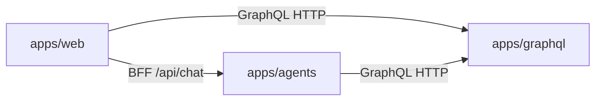

# Menuyukti platform architecture

This document describes how the Menuyukti services and packages fit together, with emphasis on the **chat-first agentic AI** path (streaming chat, modes, and tools). For local commands, ports, and CI, see [AGENTS.md](AGENTS.md). For a **user-facing overview and marketer positioning**, see [README.md](README.md).

## Platform model

Menuyukti is a **chat-first** restaurant marketing assistant. The primary product surface is **`/advisor`** (App Router under `apps/web/app/(protected)/agent/`), with chat modes **`general`** and **`image_assistant`**. Session identity is an opaque **`agentThreadId`** (LangGraph thread `{user_id}:agent:{agent_thread_id}`) — not a GraphQL workflow or milestone node.

Supporting product areas (analytics, media library, IG Studio, CRM, location calendar with **manual entries**) remain independent GraphQL-backed features. The former campaign **workflow / milestone** pipeline has been removed from the live product surface.

## Three-service system

| Service         | Path           | Role                                                                                                                                                                          |
| --------------- | -------------- | ----------------------------------------------------------------------------------------------------------------------------------------------------------------------------- |
| **Web**         | `apps/web`     | Next.js UI: `/advisor` chat, analytics, media, calendar, IG Studio, CRM. **Reads and writes product data only through GraphQL** (no application database).                    |
| **GraphQL API** | `apps/graphql` | Strawberry schema, **SQLAlchemy** persistence, **PostgreSQL**, **Alembic** migrations. **Single HTTP API** for structured data and analytics consumed by web and agents.      |
| **Agents**      | `apps/agents`  | FastAPI, **LangChain / LangGraph**. Streaming chat (`POST /chat`) and helpers. Calls GraphQL over **HTTP** (`httpx`); **does not** open database connections to product data. |

Typical local ports: GraphQL **8000**, web **3000**, agents **8001** (see [AGENTS.md](AGENTS.md) for exact dev commands).

## GraphQL service (`apps/graphql`)

- **Schema** is composed from modules under `apps/graphql/schema/` (queries, mutations, types). Entry composition lives in `apps/graphql/schema/query.py`.
- **Domain logic** that belongs in services sits under `apps/graphql/services/`.
- **Analytics and ingest** bridge through `apps/graphql/reports/transform.py`: rows are turned into DataFrames and delegated to **`packages/menuyukti`** (`calculate_*` / `compute_*` pipelines). Heavy pandas work stays out of thin resolvers; see [.agents/skills/menuyukti-graphql/SKILL.md](.agents/skills/menuyukti-graphql/SKILL.md) and [.agents/skills/menuyukti-analytics/SKILL.md](.agents/skills/menuyukti-analytics/SKILL.md).
- **Schema changes** are **only** in this app via Alembic under `apps/graphql/alembic/`.
- **Agents as clients**: chat tools call GraphQL for location/analytics/media-shaped JSON via `graphql_post` helpers — keep response shapes **stable and JSON-friendly**.

Auth and resolver conventions follow `.cursor/rules/python-graphql-conventions.mdc` (summary: session-aware resolvers, consistent with how the web app calls GraphQL).

Generic **`Node`** CRUD remains for polymorphic hierarchy rows (e.g. notes). Creating `nodeType` values from the removed campaign model (`workflow`, `milestone`, …) is rejected.

## Agents service (`apps/agents`)

### Entry points

| Endpoint                       | Purpose                                                                                                                                  |
| ------------------------------ | ---------------------------------------------------------------------------------------------------------------------------------------- |
| `POST /chat`                   | Streaming **SSE** chat over a LangGraph ReAct graph under `apps/agents/agents/core/chat/`. Requires **`agent_thread_id`**.               |
| `GET` / `DELETE /chat/history` | Load or clear checkpoint history for one agent thread.                                                                                   |
| `POST /format-markdown`        | Helper for free-form Markdown cleanup (`agents/core/format_markdown/`). Preset name labels are leftover naming, not a campaign pipeline. |

Shared GraphQL access uses `apps/agents/agents/graphql_base.py` (`graphql_post`, `GRAPHQL_ENDPOINT`, optional internal API key header). Routers authenticate callers with headers such as **`X-Menuyukti-User-Id`**; GraphQL calls use the project’s server-to-server header conventions (see `.cursor/rules/agents-conventions.mdc`).

There is **no** live `POST /milestones/.../run` API. Do not reintroduce milestone-run / preset-registry graphs as product features.

### Context engineering (chat)

1. **Short-term memory** — The streaming chat graph is compiled once with a LangGraph **checkpointer** (`compile_chat_graph` in `apps/agents/agents/core/chat/graph.py`). Each HTTP request sends **only the latest user message**; prior turns live in checkpoint state keyed by **`thread_id`**: `{clerk_user_id}:agent:{agent_thread_id}`. Production uses **`AsyncPostgresSaver`** when `LANGGRAPH_CHECKPOINT_DATABASE_URL` is set; otherwise an in-memory saver (dev only).

2. **ReAct tools** — Tools from `chat_tools_list()` load location/analytics/chart/media/Leonardo (and optional **`search_web`**) on demand. Context ids come from per-request **`RunnableConfig["configurable"]`**. The shared **`httpx` client** is bound per request via a **context variable** (`agents/core/chat/http_context.py`) so it is never stored in checkpoints.

3. **Modes** — `general` vs `image_assistant` change prompts, tools, and story-asset handling; image artifacts are mode-driven, not milestone previews.

### Cross-cutting agentic patterns

- **Chat ReAct** — conversational turns with tool use and checkpointed history.
- **Reflect** — generate → critique → revise loops where a flow still uses them (e.g. some format helpers).
- **LLMs** — configured via Vercel AI Gateway–compatible settings (`AI_GATEWAY_API_KEY`, `VERCEL_OIDC_TOKEN`, optional model allowlist); details in [AGENTS.md](AGENTS.md) and `apps/agents/.env.example`.
- **Tracing** — LangSmith when enabled; the web BFF may forward `traceparent` to agents.

## Skill files (developer docs)

| Kind                           | Location          | Role                                                                                                                                |
| ------------------------------ | ----------------- | ----------------------------------------------------------------------------------------------------------------------------------- |
| **Repository / Cursor skills** | `.agents/skills/` | **Developer documentation** for humans and IDE agents (how to change GraphQL, web, agents, analytics). **Not executed at runtime.** |

See especially `menuyukti-agents`, `menuyukti-web`, `menuyukti-graphql`, and `menuyukti-repo-orientation`.

## Tools

| Surface              | Location                                | Role                                                                                             |
| -------------------- | --------------------------------------- | ------------------------------------------------------------------------------------------------ |
| **Chat ReAct tools** | `apps/agents/agents/core/chat/tools.py` | On-demand GraphQL-backed reads (location, charts, media) and generation helpers in conversation. |

**Important:** `apps/agents` **does not import** `packages/menuyukti`. Analytics and signals reach chat tools as **GraphQL JSON** produced after `reports/transform` and related resolvers.

## Web app (`apps/web`)

- **Stack:** Next.js (App Router), React, TypeScript, **Clerk** auth, **next-intl** for user-facing copy.
- **Data:** Product entities and analytics are loaded and mutated through GraphQL (`apps/web/lib/graphql/` — client, queries, Zod node schemas).
- **Chat home:** `/advisor` (`routes.agent`); shared UI under `apps/web/components/chat/`. Thin wrappers live under `app/(protected)/agent/_components/`.
- **Chat BFF:** Next.js **`/api/chat`** (and history) proxies to agents with **`agentThreadId`** only (see [.agents/skills/menuyukti-web/SKILL.md](.agents/skills/menuyukti-web/SKILL.md)).
- **Calendar:** Manual `calendar_entry` CRUD; `schedulerCalendar` returns manual slots only. Legacy `/workflow` URLs redirect to `/advisor`.

## Packages (`packages/*`)

| Package                      | Stack                 | Role                                                                                                                                                                                    |
| ---------------------------- | --------------------- | --------------------------------------------------------------------------------------------------------------------------------------------------------------------------------------- |
| `packages/menuyukti`         | Python (uv workspace) | Shared **pandas** analytics: `calculate_*` / `compute_*`, Instagram signal composition, ingest helpers. Consumed by **`apps/graphql`** via `reports/transform`, not by agents directly. |
| `packages/ui`                | TypeScript / React    | Shared **shadcn**-style components (including AI Elements–oriented pieces) for `apps/web`.                                                                                              |
| `packages/typescript-config` | JSON                  | Shared TS config presets.                                                                                                                                                               |
| `packages/eslint-config`     | JS                    | Shared ESLint presets for web and UI.                                                                                                                                                   |
| `packages/url-safety`        | Python                | URL egress / safety utilities (workspace package; optional for future Python callers).                                                                                                  |
| `packages/docs`              | Markdown docs         | Product/domain documentation; no runtime package consumed by app code. Historical campaign notes under `packages/docs/workflows/` are stubs pointing at chat-first.                     |

## Related documentation

- [README.md](README.md) — product overview and feature summary.
- [AGENTS.md](AGENTS.md) — how to run apps, env vars, quality gates.
- [.agents/menuyukti-features.md](.agents/menuyukti-features.md) — feature glossary and code map.
- [.agents/skills/menuyukti-repo-orientation/SKILL.md](.agents/skills/menuyukti-repo-orientation/SKILL.md) — monorepo boundaries and cross-app flows.
- App READMEs: `apps/web/README.md`, `apps/graphql/README.md`, `apps/agents/README.md`.
- Cleanup history: [packages/docs/menuyukti/remove-milestones.md](packages/docs/menuyukti/remove-milestones.md).
