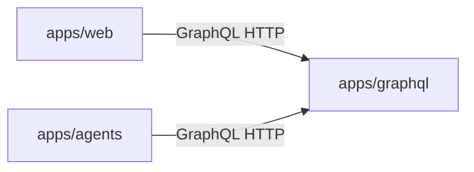
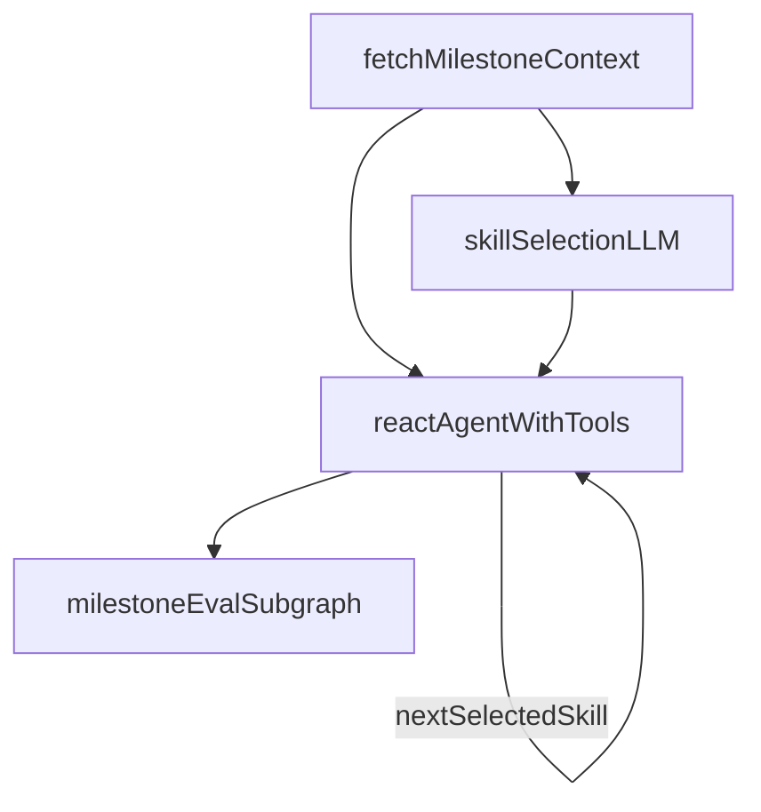

# Menuyukti platform architecture

This document describes how the Menuyukti services and packages fit together, with emphasis on the **agentic AI** path (milestone runs, skills, and tools). For local commands, ports, and CI, see [AGENTS.md](AGENTS.md). For a **user-facing overview and marketer positioning**, see [README.md](README.md).

## Platform model

Menuyukti models work as **workflow-oriented campaigns**. In GraphQL, the campaign container is a `node` with **`nodeType` `workflow`**. Under it, **milestones** run in order. Each milestone can **fetch** inputs, **invoke an LLM** (and supporting logic), and **persist output** as **milestone data** for the next step, for evaluation, or for export. The platform is optimized for **structured, reusable artifacts** (profiles, briefs, captions, scored evaluations), not chat alone.

## Three-service system

| Service         | Path           | Role                                                                                                                                                                     |
| --------------- | -------------- | ------------------------------------------------------------------------------------------------------------------------------------------------------------------------ |
| **Web**         | `apps/web`     | Next.js UI: workflows, chat, artifacts, CRUD. **Reads and writes product data only through GraphQL** (no application database).                                          |
| **GraphQL API** | `apps/graphql` | Strawberry schema, **SQLAlchemy** persistence, **PostgreSQL**, **Alembic** migrations. **Single HTTP API** for structured data and analytics consumed by web and agents. |
| **Agents**      | `apps/agents`  | FastAPI, **LangChain / LangGraph**. Streaming chat and milestone runs. Calls GraphQL over **HTTP** (`httpx`); **does not** open database connections to product data.    |

Typical local ports: GraphQL **8000**, web **3000**, agents **8001** (see [AGENTS.md](AGENTS.md) for exact dev commands).

## GraphQL service (`apps/graphql`)

- **Schema** is composed from modules under `apps/graphql/schema/` (queries, mutations, types). Entry composition lives in `apps/graphql/schema/query.py`.
- **Domain logic** that belongs in services sits under `apps/graphql/services/`.
- **Analytics and ingest** bridge through `apps/graphql/reports/transform.py`: rows are turned into DataFrames and delegated to **`packages/menuyukti`** (`calculate_*` / `compute_*` pipelines). Heavy pandas work stays out of thin resolvers; see [.agents/skills/menuyukti-graphql/SKILL.md](.agents/skills/menuyukti-graphql/SKILL.md) and [.agents/skills/menuyukti-analytics/SKILL.md](.agents/skills/menuyukti-analytics/SKILL.md).
- **Schema changes** are **only** in this app via Alembic under `apps/graphql/alembic/`.
- **Agents as clients**: milestone-run code in `apps/agents` expects **stable, JSON-friendly** response shapes from dedicated GraphQL helpers (`apps/agents/agents/core/milestone_run/graphql_client.py` and related modules).

Auth and resolver conventions follow `.cursor/rules/python-graphql-conventions.mdc` (summary: session-aware resolvers, consistent with how the web app calls GraphQL).

## Agents service (`apps/agents`)

### Entry points

| Endpoint                              | Purpose                                                                                                                                                                                                   |
| ------------------------------------- | --------------------------------------------------------------------------------------------------------------------------------------------------------------------------------------------------------- |
| `POST /chat`                          | Streaming **SSE** chat over a LangGraph graph under `apps/agents/agents/core/chat/`.                                                                                                                      |
| `POST /milestones/{milestone_id}/run` | **Milestone run**: fetch context → skill selection → ReAct with tools → persist milestone data → `finalize_eval` (shared eval subgraph). Implemented in `apps/agents/agents/core/milestone_run/graph.py`. |
| `POST /format-markdown`               | Platform helper endpoint for preset-driven Markdown cleanup (free-form notes; implemented in `apps/agents/agents/core/format_markdown/` and `apps/agents/routers/format_markdown.py`).                    |

Shared GraphQL access uses `apps/agents/agents/graphql_base.py` (`graphql_post`, `GRAPHQL_ENDPOINT`, optional internal API key header). Routers authenticate callers with headers such as **`X-Menuyukti-User-Id`**; GraphQL calls use the project’s server-to-server header conventions (see `.cursor/rules/agents-conventions.mdc`).

### Milestone-run pipeline (agentic core)

The compiled graph is `build_milestone_run_graph` in `apps/agents/agents/core/milestone_run/graph.py`. At a high level:

1. **Fetch children** — load milestone and workflow context from GraphQL (`fetch_children` node).
2. **Skill selection** (optional path) — if the run uses the LLM skill selector, a structured step chooses one or more **skill ids** from `apps/agents/agents/core/milestone_run/skills.py` (`SKILL_REGISTRY`); otherwise execution uses skills already fixed in state. Skill bodies come from per-skill `SKILL.md` files.
3. **Execute skill** — for each selected skill, a **ReAct** agent (`create_react_agent`) runs with tools from `make_milestone_run_tools` in `apps/agents/agents/core/milestone_run/tools/__init__.py`. The agent persists milestone output through **`write_result_data`** (GraphQL upsert via `apps/agents/agents/core/milestone_data/`).
4. **Finalize evaluation** — after all selected skills have run, the graph enters **`finalize_eval`**, which invokes the shared **`milestone_eval`** subgraph (`apps/agents/agents/core/milestone_eval/`) for criterion scoring, synthesis, and result persistence as defined by that graph.

### Context engineering (milestone run and chat)

Both flows ground the model in **GraphQL-backed product state**, but they use different **context packaging** strategies: milestone run **prefetches** structured slices into LangGraph state and uses **tools to surface** them inside ReAct; chat keeps the **thread small** and optionally adds **on-demand** milestone retrieval.

#### Milestone run

1. **Eager prefetch (`fetch_children`)** — Before any LLM step, the graph loads canonical milestone context from GraphQL. It reuses `milestone_eval.nodes.fetch_context`: child nodes under the milestone supply **goal** text, **milestone data** JSON on `milestonedata`, and **pass criteria** (id + requirement). When the request includes a **`workflow_id`**, **`fetch_prior_milestones_data`** adds earlier milestones’ data (JSON array text) so downstream skills can see the pipeline. **`fetch_api_adapter_tools_for_location`** loads workspace adapter metadata (used both for **prompt instructions** and **GET tools**). The milestone’s own **`data` JSON** is read to decide **LLM skill selection** vs **fixed skill ids** from configuration (`skill_settings`).

2. **Router context (skill selection)** — The structured skill-selection model receives a **single packed user message** (`skill_selector_human_message` in `apps/agents/agents/core/milestone_run/prompts.py`): formatted **skill catalog**, **goal**, **criteria as JSON**, and the **full current milestone data** snapshot. That step is optimized for **routing**, not long tool loops, so relevant fields are **explicitly inlined** once.

3. **Executor context (per-skill ReAct)** — For each selected skill, the **system prompt** is the **`SKILL.md` body** (task instructions) plus **`workspace_adapter_tools_prompt_suffix`** when adapters exist, and **`INTERMEDIATE_SKILL_PROMPT_SUFFIX`** when another skill will run after this one. The **human message** is short (`execute_skill_task_message`: which skill to run + **goal**). **Goal, criteria, milestone data, and prior-milestone JSON** also live in **`MilestoneRunState`**; the agent retrieves them through **`read_goal`**, **`read_criteria`**, **`read_data`**, and **`read_prior_milestones_data`** (see `make_milestone_run_tools` in `apps/agents/agents/core/milestone_run/tools/__init__.py`). That **tool-backed** pattern avoids pasting large or repetitive blobs on every model turn while keeping a **single source of truth** in state. **`extra_tools`** add further **pull** capabilities (for example external calendars or feeds). **`write_result_data`** commits updated milestone data through GraphQL.

4. **Evaluation subgraph** — `finalize_eval` runs **`milestone_eval`**, whose first node **`fetch_context`** loads goal, milestone data, and criteria **again from GraphQL** before parallel criterion scoring and synthesis. Eval is thus grounded on **fresh** milestone children, not only whatever the ReAct agent last held in memory.

#### Chat

1. **Short-term memory** — The streaming chat graph is compiled once with a LangGraph **checkpointer** (`compile_chat_graph` in `apps/agents/agents/core/chat/graph.py`). Each HTTP request sends **only the latest user message**; prior turns live in checkpoint state keyed by **`thread_id`**: `{clerk_user_id}:wf:{workflow_id}` for campaign chat, or `{clerk_user_id}:agent:{client_thread_id}` for the standalone `/agent` page. Production uses **`PostgresSaver`** when `LANGGRAPH_CHECKPOINT_DATABASE_URL` is set; otherwise an in-memory saver (dev only).

2. **ReAct + milestone tool** — The same **`create_react_agent`** graph always includes **`get_milestone_data`**. The tool reads **`milestone_id`**, **`location_id`**, and **`user_id`** from the per-request **`RunnableConfig["configurable"]`** (not from a recompiled graph). If milestone context is missing, the tool tells the model to answer without a milestone fetch. The shared **`httpx` client** is bound per request via a **context variable** (`agents/core/chat/http_context.py`) so it is never stored in checkpoints. **Page refresh** clears the UI transcript until a hydration endpoint exists; **regenerate** may need explicit checkpoint handling later.

### Cross-cutting agentic patterns

- **Milestone pipelines** — work is scoped to a milestone inside a workflow; outputs are stored for downstream milestones or UI.
- **Plan-and-execute** — some flows use explicit multi-step plans (data → slots → schedule → formats → brief style stages).
- **Reflect** — drafts can pass through **generate → critique → revise** with iteration bounds.
- **LLMs** — configured via Vercel AI Gateway–compatible settings (`AI_GATEWAY_API_KEY`, `VERCEL_OIDC_TOKEN`, optional `OPENAI_MODEL`); details in [AGENTS.md](AGENTS.md) and `apps/agents/.env.example`.

## Skill files (two meanings)

| Kind                           | Location                                                           | Role                                                                                                                                                                                                                                                                                                                 |
| ------------------------------ | ------------------------------------------------------------------ | -------------------------------------------------------------------------------------------------------------------------------------------------------------------------------------------------------------------------------------------------------------------------------------------------------------------- |
| **Runtime milestone skills**   | `apps/agents/agents/core/milestone_run/skills/<skill_id>/SKILL.md` | Loaded by `skill_markdown.py`: YAML frontmatter (`name`, `description`, optional **`extra_tools`**) plus a markdown **body** that instructs the ReAct agent for that milestone. Path resolution: `skill_paths.py` (`get_milestone_run_skill_path`). Each skill must be registered in `skills.py` (`SKILL_REGISTRY`). |
| **Repository / Cursor skills** | `.agents/skills/`                                                  | **Developer documentation** for humans and IDE agents (how to change GraphQL, web, agents, analytics). **Not executed at runtime.**                                                                                                                                                                                  |

## Tools (milestone run)

Tools are assembled in order by `make_milestone_run_tools` (see [.agents/skills/menuyukti-agents/SKILL.md](.agents/skills/menuyukti-agents/SKILL.md)):

1. **Core read tools** — e.g. `read_goal`, `read_criteria`, `read_data`, `read_prior_milestones_data` (LangChain tools under `apps/agents/agents/core/milestone_run/tools/`).
2. **Skill-specific extras** — names listed in the runtime `SKILL.md` **`extra_tools`** YAML list; implementations are registered in `apps/agents/agents/core/milestone_run/tools/registry.py` (`EXTRA_TOOL_FACTORIES`), typically one module per tool.
3. **`write_result_data`** — persists milestone data (milestonedata) and result payload through GraphQL.
4. **Workspace / API adapter tools** — built from GraphQL (`make_workspace_adapter_tools` and related fetch in `graphql_client.py`) so the agent can use location-scoped, configured integrations without ad hoc credentials in prompts.

**Important:** `apps/agents` **does not import** `packages/menuyukti`. Analytics and signals reach the model as **GraphQL JSON** produced after `reports/transform` and related resolvers.

## Web app (`apps/web`)

- **Stack:** Next.js (App Router), React, TypeScript, **Clerk** auth, **next-intl** for user-facing copy.
- **Data:** Product entities and analytics are loaded and mutated through GraphQL (patterns under `apps/web/lib/graphql/` and feature routes).
- **Workflows UI:** Primary campaign experience under `apps/web/app/(protected)/workflows/`.
- **BFF for milestone run:** The browser does not call the agents service directly with full auth context; Next.js **API routes** proxy/stream to **`POST /milestones/{id}/run`** on the agents service (see [.agents/skills/menuyukti-web/SKILL.md](.agents/skills/menuyukti-web/SKILL.md)).
- **Chat UI:** Uses **Vercel AI SDK** and **AI Elements**–style components in `packages/ui` for conversational surfaces; long-running **milestone execution** remains on the **Python LangGraph** service.
- **UI registries:** When adding or renaming runtime skills or documenting tools in the product UI, keep `apps/web/lib/milestone-run-skill-registry.ts` and `apps/web/lib/milestone-run-tools-registry.ts` aligned with `SKILL_REGISTRY` and tool names.

## Packages (`packages/*`)

This table lists notable runtime/shared package directories, plus docs-only package content when relevant.

| Package                      | Stack                 | Role                                                                                                                                                                                    |
| ---------------------------- | --------------------- | --------------------------------------------------------------------------------------------------------------------------------------------------------------------------------------- |
| `packages/menuyukti`         | Python (uv workspace) | Shared **pandas** analytics: `calculate_*` / `compute_*`, Instagram signal composition, ingest helpers. Consumed by **`apps/graphql`** via `reports/transform`, not by agents directly. |
| `packages/ui`                | TypeScript / React    | Shared **shadcn**-style components (including AI Elements–oriented pieces) for `apps/web`.                                                                                              |
| `packages/typescript-config` | JSON                  | Shared TS config presets.                                                                                                                                                               |
| `packages/eslint-config`     | JS                    | Shared ESLint presets for web and UI.                                                                                                                                                   |
| `packages/url-safety`        | Python                | URL egress / safety utilities (workspace member in root `pyproject.toml`).                                                                                                              |
| `packages/docs`              | Markdown docs         | Product/domain documentation (for example workflow model docs under `packages/docs/workflows/`); no runtime package consumed by app code.                                               |

## Related documentation

- [README.md](README.md) — product overview and feature summary.
- [AGENTS.md](AGENTS.md) — how to run apps, env vars, quality gates.
- [.agents/menuyukti-features.md](.agents/menuyukti-features.md) — feature glossary and code map.
- [.agents/skills/menuyukti-repo-orientation/SKILL.md](.agents/skills/menuyukti-repo-orientation/SKILL.md) — monorepo boundaries and cross-app flows.
- App READMEs: `apps/web/README.md`, `apps/graphql/README.md`, `apps/agents/README.md`.
