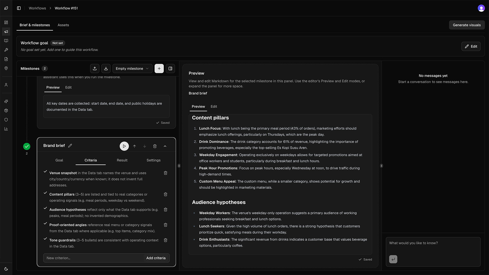
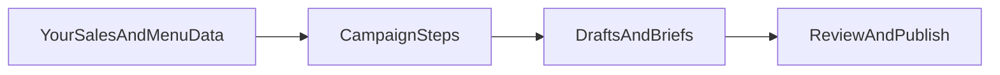
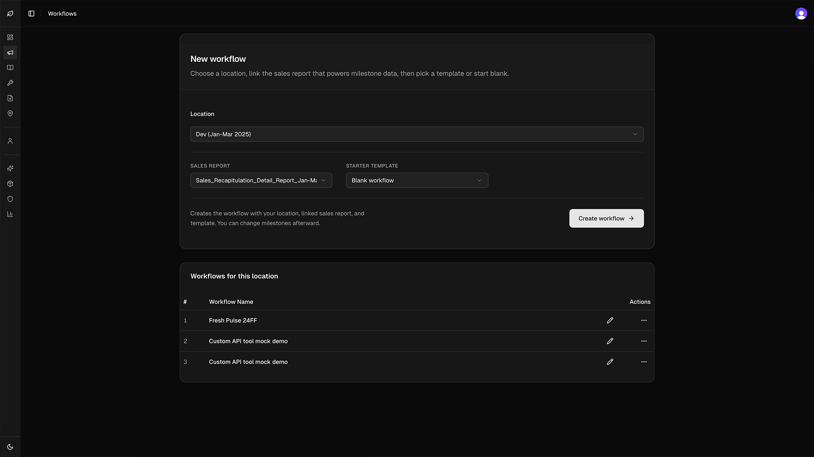
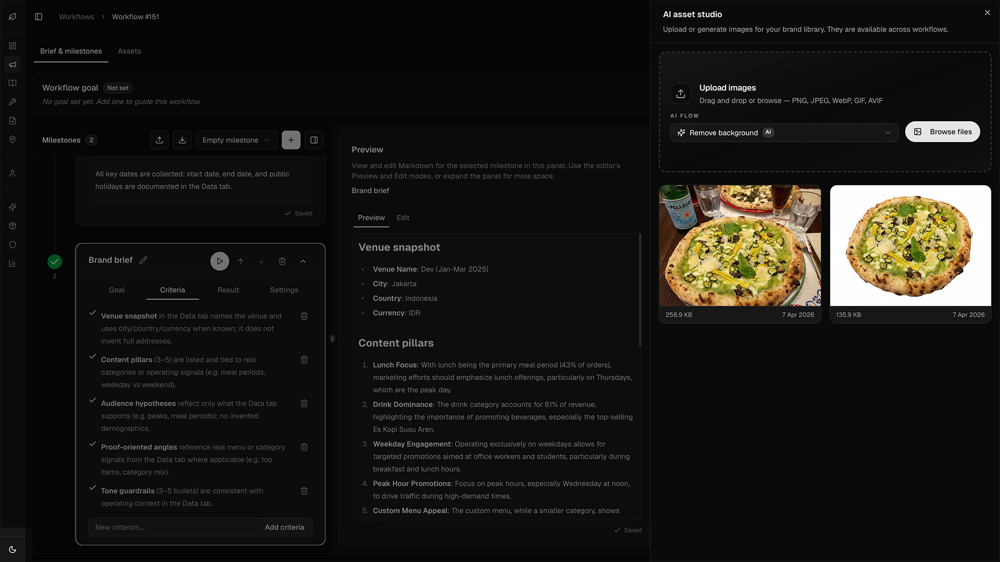
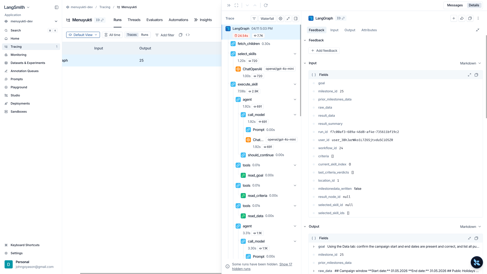
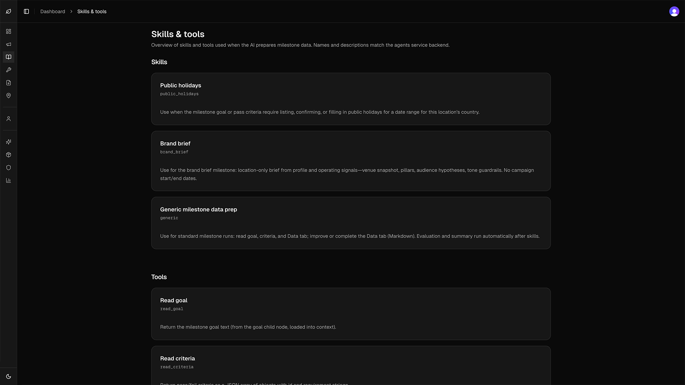
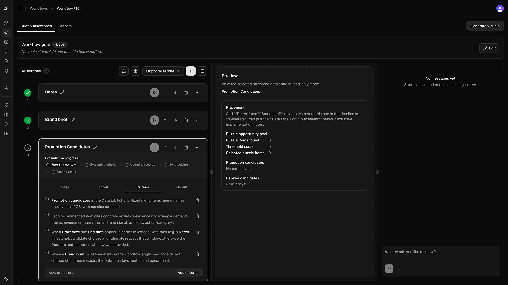
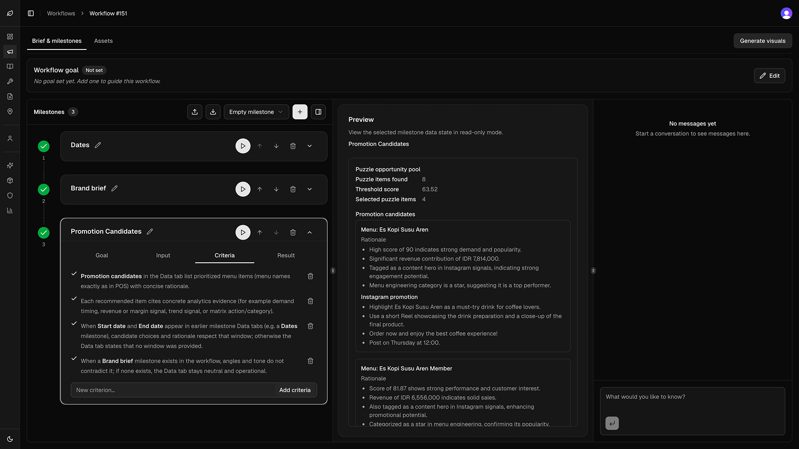
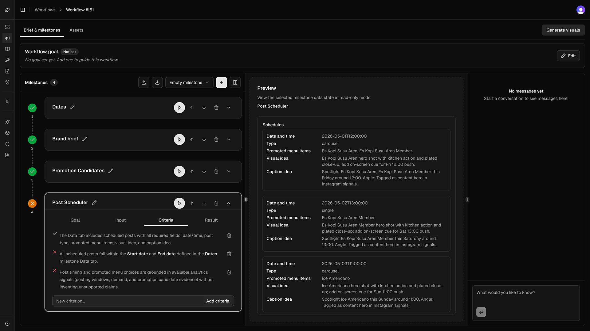
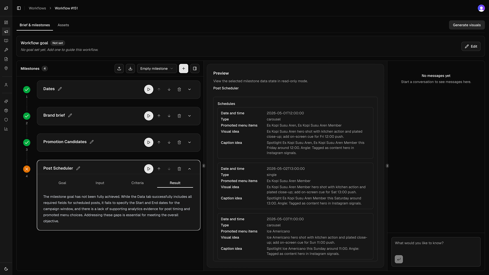

# Menuyukti

**Turn restaurant sales and operating data into structured, Instagram-ready marketing—guided by agentic AI**

Live product: <a href="https://menuyukti.com/" target="_blank" rel="noopener noreferrer">https://menuyukti.com/</a>

Menuyukti helps **restaurant marketers** go from spreadsheets and POS signals to **campaign briefs, post ideas, and copy** without rebuilding the same research and drafting work for every promotion. Each campaign produces **structured artifacts** you can review, edit, and reuse—not only a one-off chat transcript.

The product is built around **data-informed workflows**: your venue’s sales trends, menu performance, and related context ground what the AI proposes, so suggestions stay tied to what actually sells and how you operate.

## How it works

- **Campaigns as guided workflows** — A campaign is an **ordered sequence of steps** (milestones). Each step has a goal and saves its output so the next step—or your team—can build on it.
- **Your data grounds the AI** — When you link analytics to a location, that picture of demand, dishes, and patterns flows into preparation and generation, so outputs reflect your menu and performance—not generic restaurant advice.
- **AI does the heavy lifting** — For each milestone, the system can pull the right context, run **specialized AI capabilities** suited to that step, write results into the milestone, and run **automatic quality checks** against **pass criteria** you define (or start from presets).
- **Chat where it helps** — Use conversation to navigate the campaign, clarify direction, and refine drafts while the **timeline and artifacts** stay the system of record.

## Screenshots

These images come from the workflows experience in the web app, plus observability views and a catalog of agent skills and tools. File names hint at the focus of each capture.

### Workflows overview — create and list campaigns

Pick a **location**, attach the **sales report** that feeds milestone **Data**, choose a **starter template** or a blank workflow, then **Create workflow**. Existing campaigns for that location appear in the table below.

### Inside a workflow — milestones, criteria, and preview

The **Brief & milestones** view shows the ordered timeline. Each milestone can define **goals**, **criteria** (pass checks the run must satisfy), and a **preview** of the saved result—here a data-grounded brand brief (pillars, audience hypotheses). **Chat** sits beside the timeline for refinement without losing structured outputs.

### Same workflow with assets

With **Assets** (and the asset studio) open, you can upload or generate images and run lightweight AI flows (for example background removal) while staying in the same campaign context as milestones and preview.

### Under the hood — LangSmith trace of a full milestone run

When a milestone runs, the agent service executes a **LangGraph** graph. **LangSmith** (or similar tracing) shows the full waterfall: skill selection, model calls, and tools such as reading the goal, criteria, and linked data—useful for debugging, latency, and token usage during development and operations.

### Platform skills and tools

The platform surfaces the **skills** and **tools** available to milestone runs—specialized agent capabilities and integrations (for example data access, generation, and quality checks)—so teams can see what the automation layer can invoke without digging through code.

### Promotion candidates — milestone inputs and generated results

This pair tells a complete story: first the milestone context and setup, then the generated output. It helps readers quickly understand how a workflow step turns structured inputs into usable marketing ideas.

### Quality checks — post scheduler invalid examples

These captures highlight the quality-gate UX: explicit failed checks plus a summary view. They are useful to show that workflow outputs are not only generated, but also evaluated against criteria before moving forward.

### Full screenshot index

- Core workflow: `screenshot-overflows-overview.png`, `screenshot-workflow-with-milestones.png`, `screenshot-workflow-with-assets-02.png`
- Observability and platform internals: `screenshot-langsmith-full-traces-of-a-complete-run.png`, `screenshot-list-of-skills-and-tools.png`
- Milestone examples and quality gates: `screenshot-promotion-candidates.png`, `screenshot-promotion-candidates-result.png`, `screenshot-post-scheduler-invalid-example-checks.png`, `screenshot-post-scheduler-invalid-example-summary.png`

## How workflows are built

- **A workflow is a timeline** — Steps run in sequence. Later milestones can see **prior step outputs**, so the campaign stays one coherent thread (e.g. dates and holidays → brand angle → concrete post ideas).

- **Start from a template or from scratch** — When you **create a campaign**, you attach **sales/analytics** for the location. You can optionally pick a **built-in workflow template** that loads a ready-made multi-step structure with names, goals, and starter content—or start **blank** and design your own sequence.

- **Milestone presets compose the workflow** — Each time you **add a milestone**, you can insert a **blank** step or choose a **milestone preset** from the toolbar. Presets **prefill** the step: title, starter notes, task type, default **goal**, starter **quality criteria**, and (where it applies) how the AI should tackle the step first. That lets you assemble campaigns from meaningful blocks—for example **key dates and public holidays**, a **restaurant brand brief**, or **promotion and post ideas tied to menu performance**—without configuring everything by hand.

## Why restaurant marketers use it

- **On-brand, on-strategy continuity** — Steps build on each other and on criteria you set, so outputs stay aligned with the campaign’s intent.
- **Faster from data to creatives** — Less manual research and first-draft copy; more time on judgment, edits, and scheduling.
- **Repeatable playbooks** — Reuse templates and preset-based milestones across locations or time periods for consistent process.
- **Transparent outputs** — Artifacts and milestone data you can inspect and edit, not only a black-box chat.

## What you can do in the product

- **Campaign workflows and milestones** — Run ordered steps with clear goals and saved outputs between steps.
- **Templates and milestone presets** — Jump-start whole campaigns or individual steps with sensible defaults.
- **Data-driven suggestions** — Ground ideas in sales, menu, and related signals for the selected location.
- **Chat** — Collaborate and refine alongside the structured campaign surface.
- **Artifacts** — Work with generated briefs, ideas, captions, and other assets in one place.

## Setup and architecture

This repository is a monorepo: web app, GraphQL API, and agent service. For **local setup, environment variables, scripts, and CI**, see [AGENTS.md](AGENTS.md). Per-app details live in [apps/web/README.md](apps/web/README.md), [apps/graphql/README.md](apps/graphql/README.md), and [apps/agents/README.md](apps/agents/README.md).

If you want to understand **how the system is put together**—how the web app, GraphQL API, and agent service cooperate, and how **milestone runs** and **skills** work under the hood—see [ARCHITECTURE.md](ARCHITECTURE.md).
