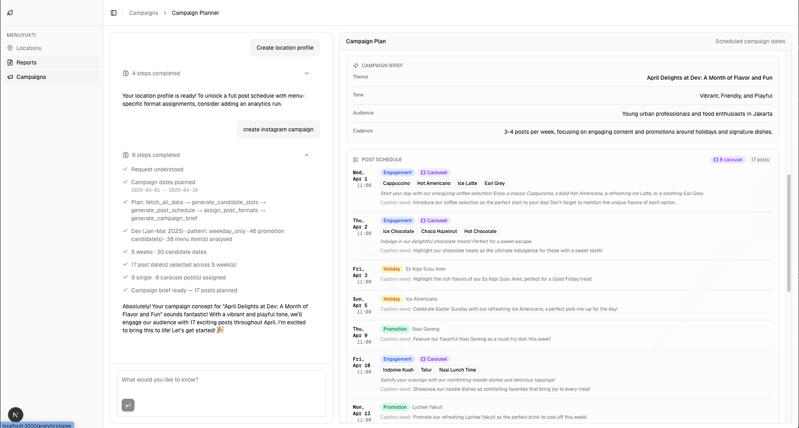

# Menuyukti

**Agentic AI platform for data-driven restaurant marketing automation**

Menuyukti turns restaurant sales data into targeted Instagram campaigns. It analyzes historical performance and generates social content for future periods—so restaurants can grow visibility and revenue with less manual work.

## Key features

- **Data-driven campaigns** — Instagram posts from sales trends, menu performance, and seasonal patterns.
- **Agentic AI** — LangGraph / LangChain agent service (`apps/agents`) for chat, milestones, and multi-step flows.
- **Chat UI** — Generate, refine, and manage marketing content through conversation.
- **Artifacts** — Review, edit, and reuse generated assets (captions, post ideas, etc.).

## Architecture

Menuyukti is split into three cooperating services:

1. **GraphQL data provider** — A Python backend that exposes GraphQL for structured data, analytics, and persistence. The web app and the agents both use this API as the single source of truth for reads and writes.
2. **Web app** — The user-facing application: conversational chat, artifact review and editing, and CRUD-style forms for entities the product manages.
3. **Agent service** — A **Python** FastAPI service (**`apps/agents`**) using LangChain / LangGraph: streaming chat, milestone flows, and location profiles. It calls the GraphQL API over HTTP when it needs platform data.

## Agentic patterns

- **Planning** — **Plan-and-execute** for the campaign pipeline: the system builds an explicit multi-step plan (data → slots → schedule → formats → brief), then runs a loop that executes each step in order until the plan completes.
- **Tool use** — LangGraph graphs can interleave model steps with tools and GraphQL-backed helpers where needed.
- **Reflect** — Draft outputs (e.g. location profiles and format plans) pass through **generate → reflect → revise** cycles: a critic step scores or critiques the draft, and the model revises until quality checks pass or a max iteration bound is hit.

## Tech stack

- **Backend:** Python, GraphQL, PostgreSQL — GraphQL API for structured data and analytics.
- **Frontend:** React, Next.js, TypeScript, Node.js.
- **AI:** Python (**`apps/agents`**, LangChain / LangGraph) for the agent HTTP service; **Vercel AI SDK** / **AI Elements** on the web for chat UI.
