# IG Gastro Cheat Sheet — Visual Guide

Diagram-first companion to [`ig-gastro-cheat-sheet.md`](./ig-gastro-cheat-sheet.md). Best for **internal / technical onboarding**. Restaurant marketers should start with [`ig-gastro-cheat-sheet-marketers.md`](./ig-gastro-cheat-sheet-marketers.md).

For narrative detail and copy examples, see the [text cheat sheet](./ig-gastro-cheat-sheet.md) and the full [playbook](./instagram-for-gastro.md).

---

## At a glance: the restaurant Instagram stack

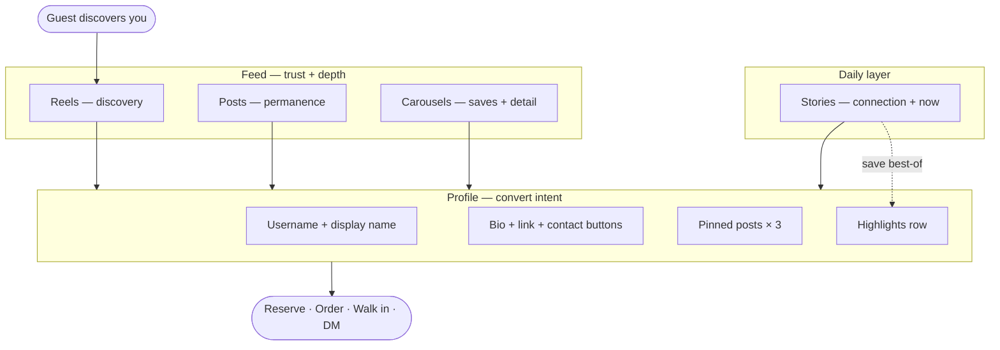

| Layer                 | Job                               | Lifespan               |
| --------------------- | --------------------------------- | ---------------------- |
| **Reels**             | Reach new people                  | Feed + recommendations |
| **Posts / carousels** | Build trust on your grid          | Permanent              |
| **Stories**           | Stay human and timely             | 24 hours               |
| **Highlights**        | Answer “before I visit” questions | Evergreen              |
| **Profile**           | Turn interest into action         | Always on              |

---

## Profile anatomy

Your profile is a small conversion page. Every block has one job.

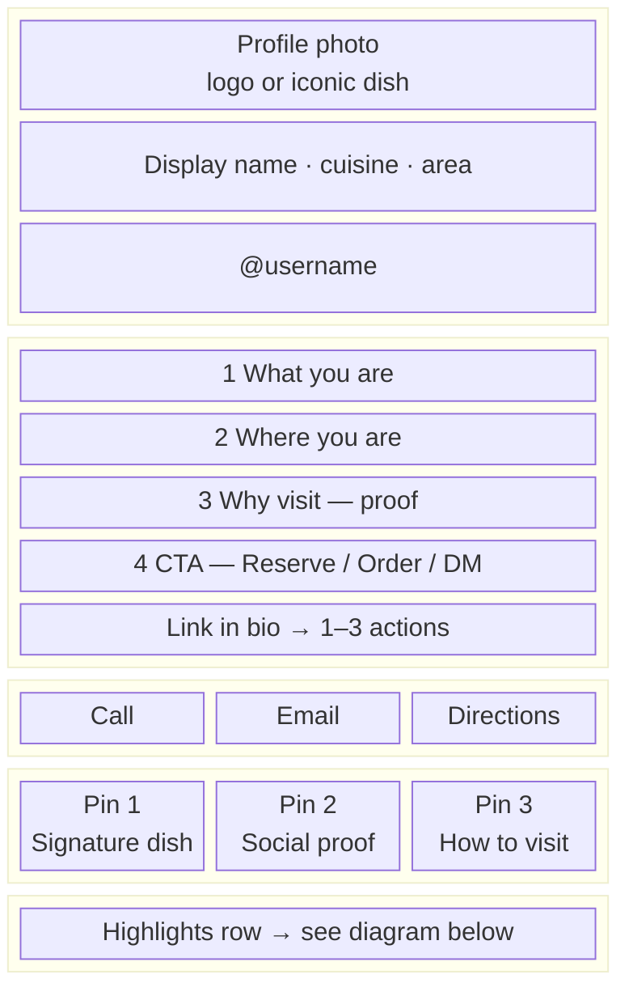

**Checklist:** searchable name · correct category (Restaurant / Cafe / Bar) · bio CTA · UTM on link · 3 pins set.

---

## Which format? Decision tree

Start with the **guest moment**, not the content you already shot.

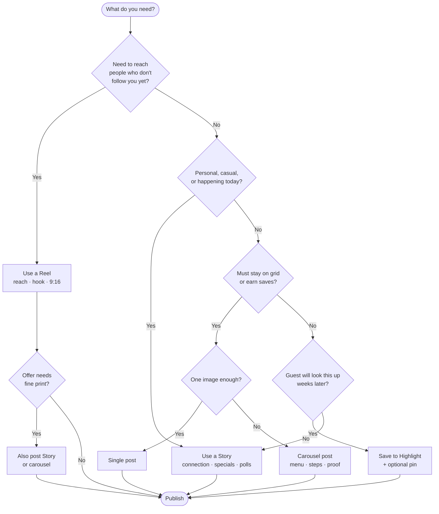

### Format × goal (quick matrix)

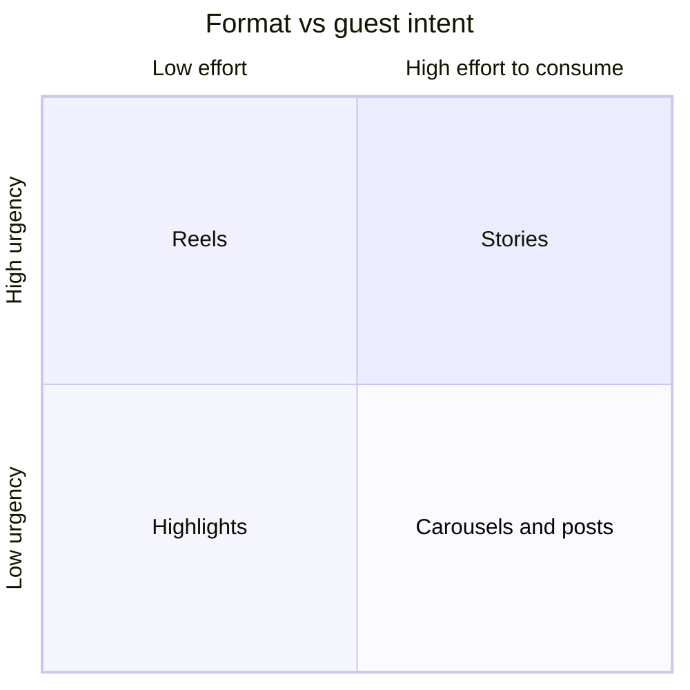

| Goal                                     | Best format             |
| ---------------------------------------- | ----------------------- |
| New people discover you                  | Reel                    |
| Guest saves for later / compares options | Carousel post           |
| Guest feels connected today              | Story                   |
| Guest acts today (offer, link)           | Story                   |
| Guest looks up info anytime              | Highlight + pinned post |

---

## When to use Reels

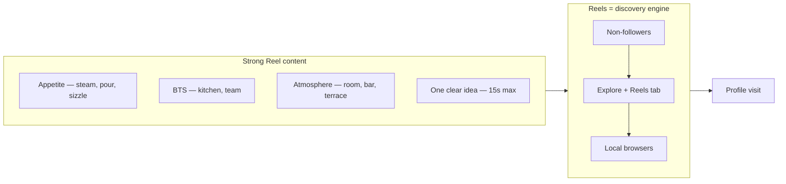

**Reel structure (15s)**

```mermaid
gantt
    title Reel timing template
    dateFormat X
    axisFormat %S s

    section Hook
    Strongest visual or line     :0, 2
    section Value
    Dish, moment, or story       :2, 8
    section Proof
    Social signal or benefit     :8, 13
    section CTA
    Reserve, order, follow       :13, 15
```

| Do                          | Don't                              |
| --------------------------- | ---------------------------------- |
| 9:16 vertical, hook in 1–2s | Full menu in one Reel              |
| Subtitles for sound-off     | Forced trends that don't fit brand |
| 1–2/week (small team)       | Promo fine print only in Reel      |

---

## When to use Stories

Stories are the **human layer** — less polished, more present. Not every frame needs a sell.

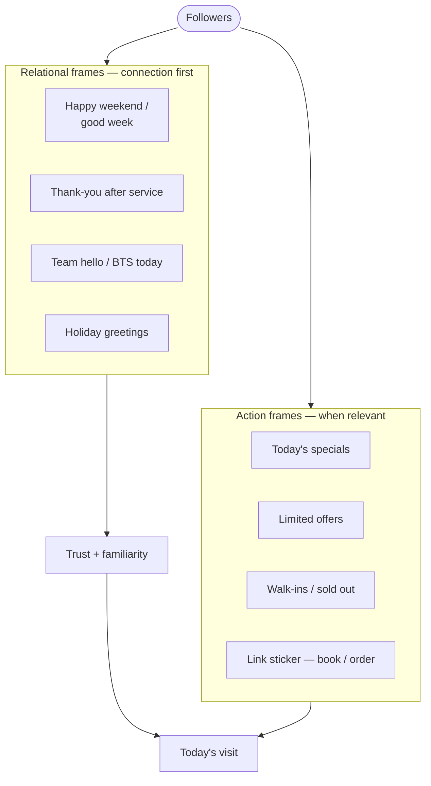

**Story mix (example day)**

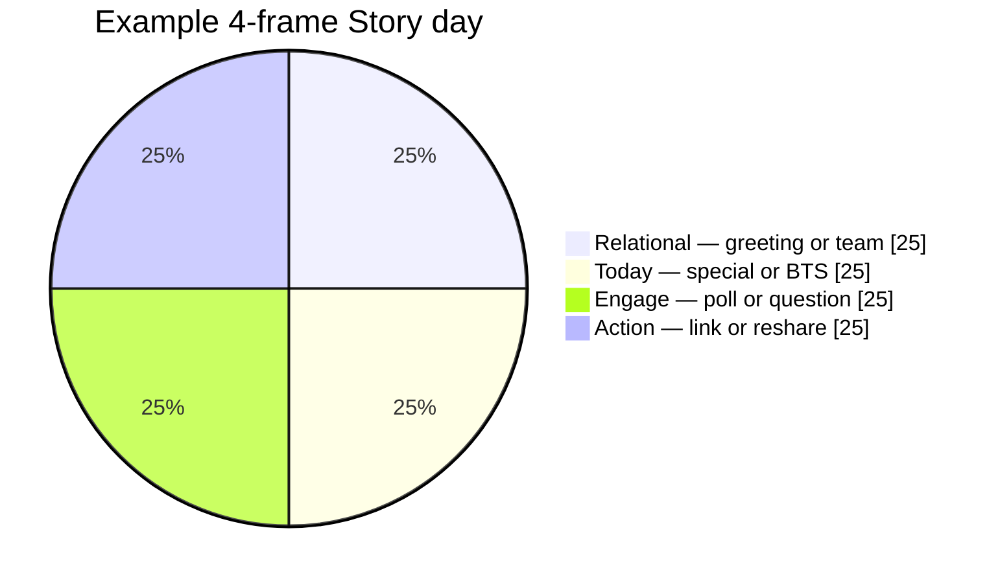

| Feature         | Use for                       |
| --------------- | ----------------------------- |
| Link sticker    | Reserve, order, event         |
| Poll / question | Menu feedback, FAQs           |
| Countdown       | Launch, brunch, collab dinner |
| Add Yours       | UGC pipeline                  |

**Cadence:** daily on service days · 2–4 frames · save evergreen answers to Highlights.

---

## When to use Posts

Posts are your **permanent storefront** — what new visitors scroll before they decide to visit.

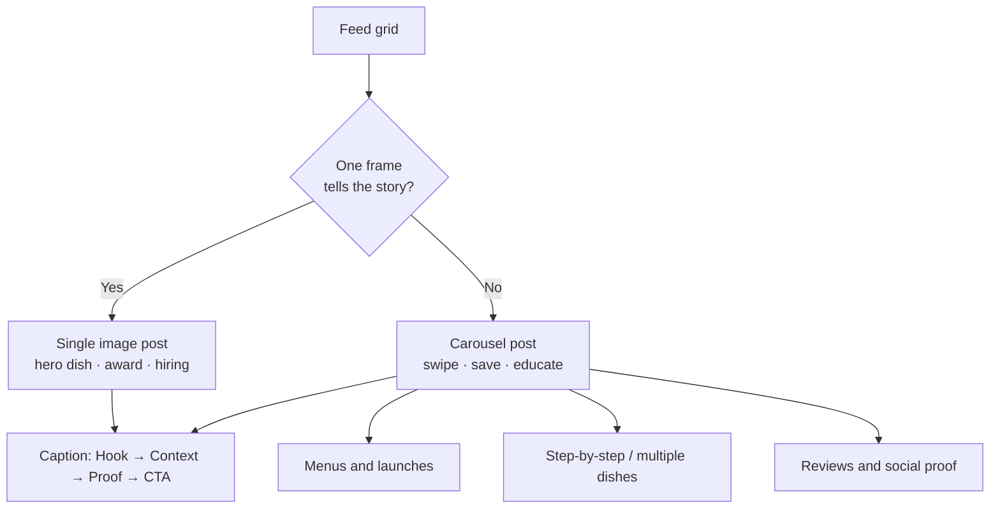

**Caption flow**

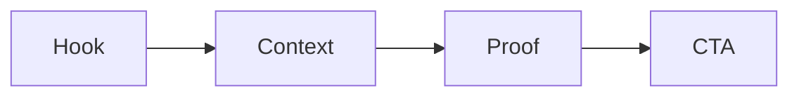

Example: _"Weekday lunch in 12 minutes → built for nearby offices → top 3 reorders this month → reserve or DM for groups."_

| Cadence    | Small team | Larger team |
| ---------- | ---------- | ----------- |
| Feed posts | 3–4 / week | 5–7 / week  |

---

## Highlights: evergreen navigation

Think of Highlights as a **mini-site** on your profile — not a archive of expired promos.

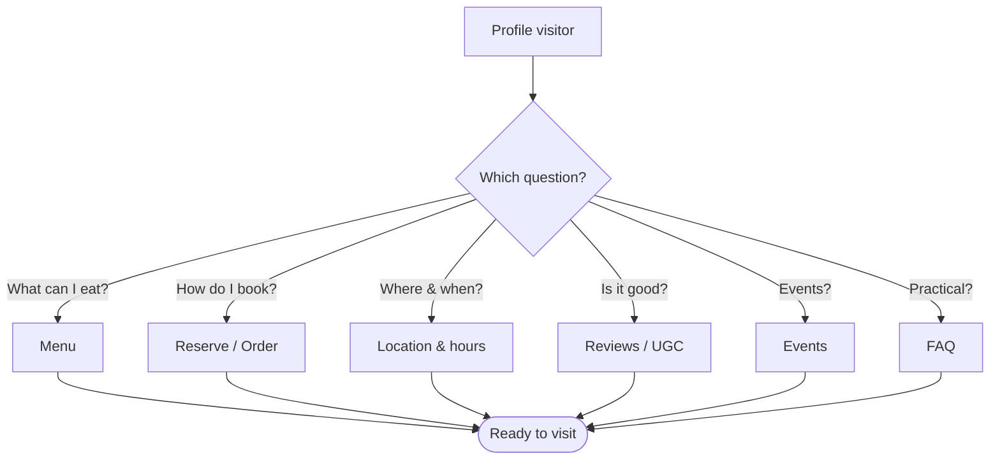

### Baseline Highlight set

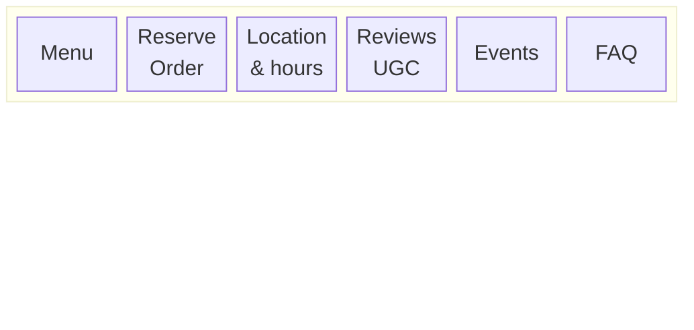

**Optional when relevant:** Behind the scenes · Drinks / Wine · New (trim when stale) · About

**Covers:** consistent icons or brand colors · short obvious titles · refresh when menu or hours change.

---

## Guest journey: discovery → visit

How formats map to the funnel.

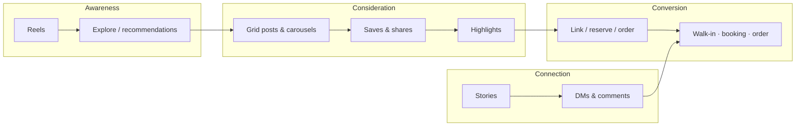

---

## Content mix

Starter ratio before you have your own data (rebalance after 4–6 weeks).

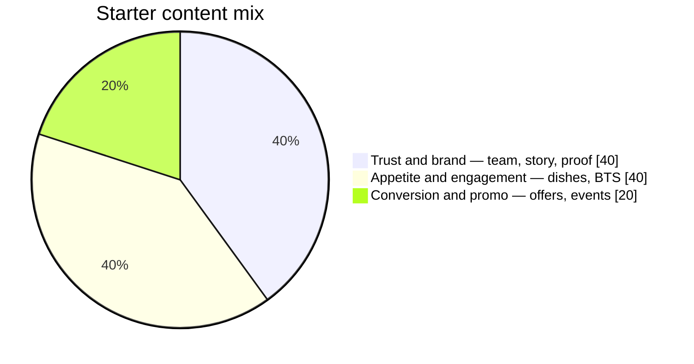

**Leading signals to watch:** saves and shares > likes alone · profile visits · DM starts.

---

## Promotions: do vs don't

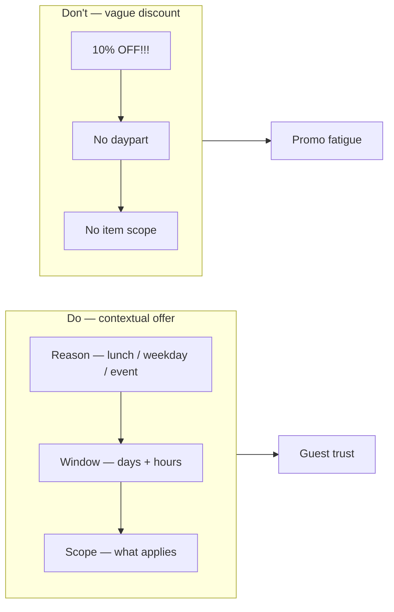

Good: _"Lunch offer Mon–Fri, 11:00–14:00 — 10% off mains for nearby offices."_

---

## One-page weekly rhythm (small team)

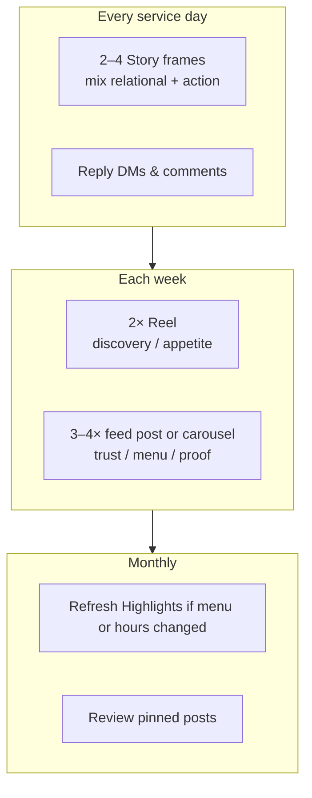

| When        | What                        |
| ----------- | --------------------------- |
| Mon–Sun     | Stories + community replies |
| 2× / week   | Reel                        |
| 3–4× / week | Post or carousel            |
| Monthly     | Highlights + pins           |

---

## Measurement loop

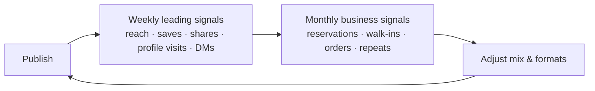

Instrument with: UTM links · unique offer codes · “how did you hear about us?” at host stand or checkout.

---

## Related docs

- [IG Gastro Cheat Sheet](./ig-gastro-cheat-sheet.md) — full text reference
- [Instagram for Restaurant Marketers](./instagram-for-gastro.md) — complete playbook
