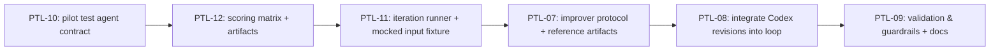

# Epic: Agent Prompt Tuning Evaluation Loop (Pilot)

## Epic ID
EPIC-AGENT-PROMPT-TUNING-EVAL-LOOP

## Owner
TBD

## Status
In Progress

## Reopened Date
2026-02-20

## Reopen Reason
Initial pilot implementation used heuristic prompt-edit rules instead of Codex-orchestrated analysis and prompt improvement. The epic is reopened to implement the intended Codex-in-the-loop iteration workflow.

## Goal
Prove a reliable workflow that automatically improves one agent prompt through iterative score-based evaluation, then freezes the best prompt when it passes threshold.

## Why This Epic
- Establishes a minimal, practical pattern before scaling to all agents.
- Prevents subjective prompt edits by enforcing measurable score gates.
- Produces evidence that the loop is stable and worth generalizing.

## In Scope
- One pilot agent only: `marketer-strategist`.
- One simple use case only: create Instagram caption output from fixed input.
- Mocked input data only across all pilot runs.
- Define pilot test dataset and expected output scoring rubric upfront.
- Implement loop where Codex analyzes scored output and improves prompt per iteration.
- Persist run evidence and selected prompt version.
- Define explicit “ready to scale” criteria for applying the workflow to other agents.

## Out of Scope
- Applying this loop to all agents in this epic.
- Multi-agent orchestration changes.
- Live user-feedback online learning.
- Fully autonomous production rollout.
- Model/provider experimentation for this pilot (model and provider are fixed to isolate prompt impact).
- Live production data sources for evaluation inputs.
- Global rollout of prompt-improvement workflow across all agents before pilot validation.

## Delivery Sequence (Hard Order)
1. Define output scoring specs.
2. Define mocked input set for scoring tests.
3. Run prompt iteration against mocked test set.
4. Codex analyzes output and failure signals.
5. Test output against scoring specs.
6. If score is below threshold, Codex improves prompt and repeat from step 3.
7. If score is above threshold, Codex stops, freezes selected prompt, and reports final score.

## Story List
1. **PTL-01: Pilot Agent Contract and Test Dataset**
- Define `marketer-strategist` pilot input/output contract and fixed test cases.

2. **PTL-02: Expected Output Scoring Specification**
- Define scoring dimensions, weights, and pass threshold before any prompt iteration.

3. **PTL-03: Baseline Prompt and Evaluation Runner**
- Create initial prompt and run baseline scoring report.

4. **PTL-04: Automatic Prompt Improvement Loop**
- Implement repeat-until-pass loop with bounded iterations and deterministic scoring output.

5. **PTL-05: Prompt Freeze and Pilot Readiness Report**
- Freeze winning prompt and produce “ready to scale” decision report.

6. **PTL-06: Pilot Workflow Documentation**
- Document end-to-end setup, scoring spec authoring, run commands, artifact interpretation, and scale-out guidance for other agents.

7. **PTL-07: Codex Prompt Improver Protocol Spec (Pilot-Only)**
- Define pilot-only Codex improver protocol (input/output/constraints) for iterative prompt refinement and keep scope non-global.

8. **PTL-08: Codex-Driven Prompt Improvement Integration**
- Replace heuristic prompt improvement with Codex-generated prompt revisions per iteration while preserving deterministic scoring gate.

9. **PTL-09: Codex Improver Validation and Safety Guardrails**
- Add tests and guardrails for malformed/improper Codex revisions, fallback behavior, and artifact traceability per iteration.

10. **PTL-10: Test Agent Definition and Runtime Surface (Pilot-Only)**
- Create a dedicated test agent with explicit task definition, input contract, and output contract as the tuning target.

11. **PTL-11: Iterating Prompt + Mocked Input Invocation Loop**
- Bind iterating prompt versions to mocked input fixtures and invoke the test agent per iteration with scoring-gate feedback.

12. **PTL-12: Codex Scoring Matrix and Iteration Artifact Contract**
- Define Codex-applied scoring matrix and the runtime file contract (`output.json`, `score.json`, `iteration-summary.json`) used between invoke-score-improve steps.

## Reopened Execution Order
1. `PTL-10` (first): define and ship pilot test-agent contract + runtime surface.
2. `PTL-12`: define Codex scoring matrix and file-based runtime artifact contract.
3. `PTL-11`: wire iterating prompt + mocked-input invocation against PTL-10 agent using PTL-12 artifacts.
4. `PTL-07`: define Codex improver protocol for pilot.
5. `PTL-08`: integrate Codex-driven prompt improvement in loop.
6. `PTL-09`: add improver validation and safety guardrails.

## Completed Stories
- `PTL-12` (Execution Order 2, Status: `complete`): Codex scoring matrix + iteration artifact contract; see `packages/docs/planning/archive/EPIC-AGENT-PROMPT-TUNING-EVAL-LOOP/001-story-ptl-12-llm-scoring-matrix-and-iteration-artifact-contract.md`.
- `PTL-11` (Execution Order 3, Status: `complete`): Iteration loop + mocked-input invocation; see `packages/docs/planning/archive/EPIC-AGENT-PROMPT-TUNING-EVAL-LOOP/002-story-ptl-11-iterating-prompt-and-mocked-input-invocation-loop.md`.
- `PTL-07` (Execution Order 4, Status: `complete`): Codex improver protocol spec; see `packages/docs/planning/archive/EPIC-AGENT-PROMPT-TUNING-EVAL-LOOP/003-story-ptl-07-llm-prompt-improver-agent-spec-pilot-only.md`.
- `PTL-08` (Execution Order 5, Status: `complete`): Codex-driven prompt improvement integration; see `packages/docs/planning/archive/EPIC-AGENT-PROMPT-TUNING-EVAL-LOOP/004-story-ptl-08-llm-driven-prompt-improvement-integration.md`.

## Current Open Story Queue
1. `PTL-09` (Execution Order 6, Status: `todo`): validation & safety guardrails for improver outputs plus documentation updates; see `packages/docs/planning/todo/005-story-ptl-09-llm-improver-validation-and-safety-guardrails.md`.

## Workflow Walkthrough
- PTL-10 defines the pilot test agent + contract, PTL-12 locks down how scoring artifacts look, and PTL-11 wires the mocked inputs and iteration runner so the artifacts are generated reliably.
- PTL-07/PTL-08 reuse the artifact samples in `packages/docs/planning/blueprints/iteration-artifacts-samples.md` to show how Codex receives failing dimensions, emits a candidate, and feeds the loop.
- PTL-09 closes the loop by matching guardrail tests/safety notes to the documented `iteration-summary.json` stop reasons.



## Pilot Example (Concrete)
- Agent: `marketer-strategist`
- Data source: mocked fixtures only (no live DB/API input)
- Input fields: `restaurant_name`, `menu_item`, `target_audience`, `tone`
- Output fields: `caption`, `cta`, `hashtags`
- Score threshold: `>= 80/100`
- Loop rule: if score `< 80`, improve prompt and rerun; if score `>= 80`, finish and freeze.

## Scoring Spec Example (Pilot)

```yaml
spec_id: caption_pilot_v1
orchestrator: codex
execution_model: "agent runtime writes output.json; codex writes score.json and iteration-summary.json"
agent_id: marketer-strategist
task: instagram_caption_generation
thresholds:
  pass_score: 80
  critical_fail_if_any:
    - invalid_json
    - missing_required_field

output_contract:
  required_fields:
    - caption
    - cta
    - hashtags
  hashtags:
    min_items: 2
    max_items: 4

dimensions:
  - id: schema_validity
    type: binary
    weight: 20
    scoring_rule: "20 if valid JSON and required fields exist, else 0"

  - id: menu_item_mention
    type: binary
    weight: 25
    scoring_rule: "25 if caption contains exact menu_item string, else 0"

  - id: premium_tone
    type: rubric
    weight: 20
    scoring_rule: "0-20 by rubric: premium wording, no slang, concise"

  - id: cta_actionability
    type: rubric
    weight: 20
    scoring_rule: "20 if CTA starts with action verb and is specific, else partial"

  - id: hashtag_quality
    type: binary
    weight: 15
    scoring_rule: "15 if 2-4 relevant hashtags, else partial"

calculation:
  total_score: "sum(dimension_scores)"
  pass_condition: "total_score >= 80 and no critical fail"
  baseline_improvement_min: "+8 vs v1 baseline"
  regression_guard: "no critical dimension score below baseline"

iteration_policy:
  max_iterations: 5
  retry_when: "total_score < 80"
  stop_when: "pass_condition == true and baseline_improvement_min satisfied and regression_guard satisfied"
  fail_when: "max_iterations reached without stop_condition"
  freeze_on_pass: true

determinism_policy:
  model_id_fixed: true
  provider_fixed: true
  temperature: 0
  top_p: 1
  reruns_per_candidate: 3
  final_candidate_score: "median(total_score)"

artifact_schema:
  required_fields:
    - run_id
    - run_timestamp
    - agent_id
    - prompt_version
    - dataset_version
    - scoring_spec_version
    - model_id
    - provider
    - per_case_scores
    - total_score
    - pass_fail
    - baseline_delta
    - selected_candidate
    - stop_reason
  iteration_files:
    - output.json
    - score.json
    - iteration-summary.json
```

## Acceptance Criteria
- Pilot loop runs end-to-end for one agent and one simple scenario.
- Tuning cannot start unless test data and scoring spec are defined first.
- All evaluation inputs in pilot runs come from versioned mocked fixtures only.
- Each run emits a numeric output score and pass/fail status.
- Loop automatically repeats prompt improvement when score is below threshold.
- Codex is used to analyze iteration output and propose prompt improvements each cycle.
- Loop stops and freezes prompt when score meets threshold.
- Model/provider stay fixed during pilot runs so quality changes are attributable to prompt changes.
- Candidate must satisfy minimum improvement over baseline and regression guard, not only threshold.
- If max iterations are reached without passing conditions, loop exits with explicit fail report and manual-review signal.
- Evidence includes baseline score, iteration history, final score, and frozen prompt version.
- A short scale-readiness checklist is produced for rollout to additional agents.
- Documentation exists for operators/engineers to run and maintain the pilot loop without tribal knowledge.
- Codex-generated prompt revision is used in each below-threshold iteration; heuristic-only path is no longer the primary improver.
- Loop keeps deterministic scoring as final gate even when Codex is used for prompt improvement.
- A dedicated test agent contract (task, inputs, outputs) exists and is used as the pilot tuning target.

## Risks
- Pilot may overfit to a narrow test case.
- Scoring may not reflect real business quality if poorly weighted.
- Model variance can cause unstable iteration outcomes.

## Mitigations
- Separate strict checks (schema, required fields) from flexible checks (style/tone).
- Keep rubric simple and documented with fixed weights.
- Use fixed model settings and max iteration cap for predictable runs.

## Documentation Requirements (PTL-06)
- Operator runbook for executing the loop end-to-end.
- Scoring spec authoring guide with examples of binary and rubric dimensions.
- Artifact interpretation guide (baseline delta, regressions, stop reasons).
- Troubleshooting section for max-iteration failures and unstable scores.
- "Onboard Next Agent" checklist to replicate this pilot workflow for additional agents.
